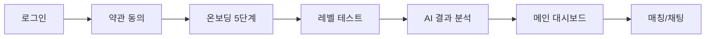

# 사용자 플로우 전체 문서

## 📱 전체 사용자 여정 (User Journey)



## 🔄 상세 플로우 매핑

### Phase 1: 인증 및 가입 ✅ (구현 완료)

| 단계 | 페이지 | 경로 | 상태 | 설명 |
|------|--------|------|------|------|
| 1-1 | 로그인 | `/` | ✅ 구현됨 | 네이버/구글 소셜 로그인 |
| 1-2 | OAuth 콜백 | `/login/oauth2/code/naver` | ✅ 구현됨 | 네이버 인증 처리 |
| 1-3 | 약관 동의 | `/agreement` | ✅ 구현됨 | 서비스 이용약관 동의 |
| 1-4 | 가입 완료 | `/signup-complete` | ✅ 구현됨 | 회원가입 완료 안내 |

### Phase 2: 온보딩 ✅ (구현 완료)

#### 2-1. 기본 정보 (ObInfo)
| 단계 | 경로 | 구현 상태 | 내용 |
|------|------|-----------|------|
| Step 1 | `/onboarding-info/1` | ✅ | 이름 입력 |
| Step 2 | `/onboarding-info/2` | ✅ | 생년월일 |
| Step 3 | `/onboarding-info/3` | ✅ | 성별 선택 |
| Step 4 | `/onboarding-info/4` | ✅ | 프로필 사진 |
| Complete | `/onboarding-info/complete` | ✅ | 섹션 완료 |

#### 2-2. 언어 설정 (ObLang)
| 단계 | 경로 | 구현 상태 | 내용 |
|------|------|-----------|------|
| Step 1 | `/onboarding-lang/1` | ✅ | 모국어 선택 |
| Step 2 | `/onboarding-lang/2` | ✅ | 학습 언어 선택 |
| Step 3 | `/onboarding-lang/3` | ✅ | 언어 수준 |
| Complete | `/onboarding-lang/complete` | ✅ | 섹션 완료 |

#### 2-3. 관심사 (ObInt)
| 단계 | 경로 | 구현 상태 | 내용 |
|------|------|-----------|------|
| Step 1 | `/onboarding-int/1` | ✅ | 취미 선택 |
| Step 2 | `/onboarding-int/2` | ✅ | 관심 주제 |
| Step 3 | `/onboarding-int/3` | ✅ | 학습 목적 |
| Step 4 | `/onboarding-int/4` | ✅ | 추가 관심사 |
| Complete | `/onboarding-int/complete` | ✅ | 섹션 완료 |

#### 2-4. 파트너 선호 (ObPartner)
| 단계 | 경로 | 구현 상태 | 내용 |
|------|------|-----------|------|
| Step 1 | `/onboarding-partner/1` | ✅ | 선호 파트너 유형 |
| Step 2 | `/onboarding-partner/2` | ✅ | 학습 스타일 |
| Complete | `/onboarding-partner/complete` | ✅ | 섹션 완료 |

#### 2-5. 스케줄 (ObSchedule)
| 단계 | 경로 | 구현 상태 | 내용 |
|------|------|-----------|------|
| Step 1 | `/onboarding-schedule/1` | ✅ | 선호 시간대 |
| Step 2 | `/onboarding-schedule/2` | ✅ | 주간 가능 일정 |
| Step 3 | `/onboarding-schedule/3` | ✅ | 세션 길이 |
| Step 4 | `/onboarding-schedule/4` | ✅ | 시간대 설정 |
| Complete | `/onboarding-schedule/complete` | ✅ | 온보딩 전체 완료 |

### Phase 3: 레벨 테스트 ❌ (구현 필요)

| 단계 | 페이지 | 경로(예상) | 구현 상태 | 스크린샷 | 설명 |
|------|--------|-----------|-----------|----------|------|
| 3-1 | 테스트 소개 | `/level-test` | ❌ 미구현 | 12.33.06.png | 레벨 테스트 시작 안내 |
| 3-2 | 연결 확인 | `/level-test/connection` | ❌ 미구현 | 12.33.11.png | 마이크/인터넷 체크 |
| 3-3 | 질문 1 | `/level-test/question/1` | ❌ 미구현 | 12.33.17.png | 첫 번째 음성 질문 |
| 3-4 | 질문 2 | `/level-test/question/2` | ❌ 미구현 | - | 두 번째 음성 질문 |
| 3-5 | 질문 3 | `/level-test/question/3` | ❌ 미구현 | - | 세 번째 음성 질문 |
| 3-6 | 질문 4 | `/level-test/question/4` | ❌ 미구현 | - | 네 번째 음성 질문 |
| 3-7 | 완료 | `/level-test/complete` | ❌ 미구현 | 12.33.20.png | 테스트 완료 안내 |
| 3-8 | AI 결과 | `/level-test/result` | ❌ 미구현 | 12.35.08.png | AI 분석 결과 표시 |

### Phase 4: 메인 대시보드 ⚠️ (부분 구현)

| 페이지 | 경로 | 구현 상태 | 설명 |
|--------|------|-----------|------|
| 메인 | `/main` | ✅ 구현됨 | 대시보드 홈 |
| 프로필 | `/profile` | ⚠️ 개선 필요 | 사용자 프로필 |
| 통계 | `/stats` | ❓ 미확인 | 학습 통계 |

### Phase 5: 매칭 시스템 ❌ (구현 필요)

| 페이지 | 경로(예상) | 구현 상태 | 스크린샷 | 설명 |
|--------|-----------|-----------|----------|------|
| 매칭 목록 | `/matching` | ❌ 미구현 | - | 추천 파트너 목록 |
| 매칭 프로필 | `/matching/profile/:userId` | ❌ 미구현 | 12.35.19.png | 파트너 상세 정보 |
| 매칭 요청 | `/matching/request` | ❌ 미구현 | - | 매칭 요청 전송 |

### Phase 6: 채팅 시스템 ⚠️ (개선 필요)

| 기능 | 경로 | 구현 상태 | 스크린샷 | 개선 사항 |
|------|------|-----------|----------|-----------|
| 채팅 목록 | `/chat` | ✅ 기본 구현 | 1.47.55.png | 검색, 필터 기능 |
| 채팅방 | `/chat/:roomId` | ✅ 기본 구현 | 1.48.05.png, 1.48.34.png | 실시간 상태 |
| 텍스트 메시지 | - | ✅ 구현됨 | 1.48.34.png | - |
| 이미지 전송 | - | ❓ 미확인 | - | 이미지 업로드 |
| 음성 메시지 | - | ❌ 미구현 | 1.48.43.png | 녹음/재생 기능 |
| 영상 통화 | - | ❌ 미구현 | - | WebRTC 구현 |

### Phase 7: 세션(Session) ❌ (신규 - 구현 필요)

| 기능 | 경로(예상) | 구현 상태 | 스크린샷 | 설명 |
|------|-----------|-----------|----------|------|
| 세션 목록 | `/session` | ❌ 미구현 | 1.49.26.png | 예정된 세션 목록 |
| 세션 캘린더 | `/session/calendar` | ❌ 미구현 | 1.49.37.png | 월간 세션 일정 |
| 오디오 연결 체크 | `/session/audio/connection` | ❌ 미구현 | 1.51.12.png | 마이크 체크 |
| 비디오 연결 체크 | `/session/video/connection` | ❌ 미구현 | 1.52.48.png | 카메라/마이크 체크 |
| 오디오 세션 (1:1) | `/session/audio/:roomId` | ❌ 미구현 | 1.51.30.png | 1:1 오디오 통화 |
| 오디오 세션 (그룹) | `/session/audio/:roomId` | ❌ 미구현 | 1.52.03.png | 최대 4인 오디오 |
| 비디오 세션 (전체) | `/session/video/:roomId` | ❌ 미구현 | 1.52.53.png | 전체 화상 통화 |
| 비디오 세션 (혼합) | `/session/video/:roomId` | ❌ 미구현 | 1.53.04.png | 화상+오디오 혼합 |
| 세션 예약 | `/session/book` | ❌ 미구현 | - | 세션 예약 |

## 🔀 페이지 전환 로직

### 1. 신규 사용자 플로우
```
로그인 → 약관 동의 → 온보딩(5단계) → 레벨 테스트 → AI 결과 → 메인
```

### 2. 기존 사용자 플로우
```
로그인 → 메인 → (매칭/채팅/프로필 등)
```

### 3. 온보딩 중단 후 재접속
```
로그인 → 마지막 온보딩 단계부터 이어하기
```

## 📊 구현 현황 요약

| 카테고리 | 전체 | 구현 완료 | 구현 필요 | 개선 필요 |
|---------|------|-----------|-----------|-----------|
| 인증/가입 | 4 | 4 (100%) | 0 | 0 |
| 온보딩 | 20 | 20 (100%) | 0 | 0 |
| 레벨 테스트 | 8 | 0 (0%) | 8 | 0 |
| 매칭 | 3 | 0 (0%) | 3 | 0 |
| 채팅 | 6 | 3 (50%) | 2 | 1 |
| 세션 | 9 | 0 (0%) | 9 | 0 |
| 메인/기타 | 3 | 1 (33%) | 0 | 2 |
| **총계** | **53** | **28 (53%)** | **22 (41%)** | **3 (6%)** |

## 🎯 개발 우선순위

### Priority 1 (핵심 기능)
1. **레벨 테스트 전체 플로우** (8개 페이지)
   - 음성 녹음 기능
   - AI 연동
   - 결과 시각화

### Priority 2 (주요 기능)
2. **매칭 시스템** (3개 페이지)
   - 추천 알고리즘
   - 프로필 표시

### Priority 3 (개선 사항)
3. **채팅 고도화**
   - 음성 메시지
   - 실시간 상태
   - 이미지 전송

## 🔗 페이지 간 데이터 흐름

### 온보딩 → 레벨 테스트
- 전달 데이터: 사용자 기본 정보, 언어 설정
- 저장 위치: localStorage 또는 Zustand store

### 레벨 테스트 → AI 결과
- 전달 데이터: 음성 녹음 파일 4개
- 처리: 백엔드 AI 분석
- 반환: 6개 영역 점수, 레벨 판정

### AI 결과 → 매칭
- 전달 데이터: 레벨, 관심사, 선호 파트너 조건
- 처리: 매칭 알고리즘
- 반환: 추천 파트너 목록

## 📝 기술 요구사항

### 레벨 테스트
- MediaRecorder API (음성 녹음)
- Web Audio API (오디오 레벨)
- WebSocket (실시간 전송)
- Recharts (레이더 차트)

### 매칭
- REST API 연동
- 실시간 상태 (WebSocket)
- 필터링/정렬 로직

### 채팅
- Socket.io 또는 StompJS
- 파일 업로드 (이미지)
- 음성 녹음/재생
- 푸시 알림

## ✅ 완료 체크리스트

### 구현 완료 ✅
- [x] 로그인/회원가입
- [x] 온보딩 전체
- [x] 기본 채팅 기능
- [x] 메인 페이지

### 구현 필요 ❌
- [ ] 레벨 테스트 시작
- [ ] 연결 상태 확인
- [ ] 음성 질문 (4개)
- [ ] 테스트 완료
- [ ] AI 결과 분석
- [ ] 매칭 목록
- [ ] 매칭 프로필
- [ ] 음성 메시지

### 개선 필요 ⚠️
- [ ] 채팅 실시간 상태
- [ ] 채팅 검색/필터
- [ ] 프로필 페이지