# 시스템 아키텍처

## 📋 아키텍처 개요

STUDYMATE는 마이크로서비스 지향 아키텍처를 기반으로 한 언어 교환 학습 플랫폼입니다. 클라이언트-서버 구조로 설계되어 있으며, 실시간 통신과 AI 기반 언어 교정 서비스를 제공합니다.

## 🏗️ 전체 시스템 아키텍처

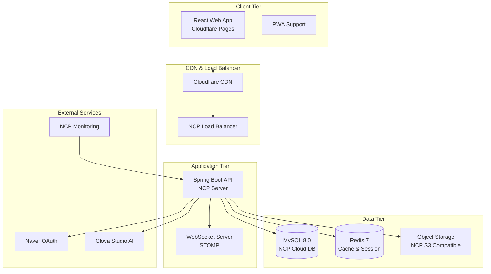

## 🌐 네트워크 아키텍처

### VPC 구성 (NCP)
```
VPC: studymate-vpc (10.0.0.0/16)
├── Public Subnet (10.0.1.0/24)
│   ├── Load Balancer
│   └── Bastion Host
├── Private Subnet (10.0.2.0/24)
│   ├── Application Servers
│   └── Redis Cluster
└── Database Subnet (10.0.3.0/24)
    └── MySQL Cluster
```

### 도메인 구조
```
Production:
├── languagemate.kr (Frontend - Cloudflare Pages)
├── api.languagemate.kr (Backend API - NCP)
└── cdn.languagemate.kr (Static Assets - NCP CDN)

Staging:
├── preview.languagemate.kr (Frontend)
└── api-staging.languagemate.kr (Backend)
```

## 📱 클라이언트 아키텍처 (STUDYMATE-CLIENT)

### React 애플리케이션 구조
```
src/
├── components/           # 재사용 가능한 컴포넌트
│   ├── common/          # 공통 컴포넌트
│   ├── forms/           # 폼 관련 컴포넌트
│   └── ui/              # UI 기본 컴포넌트
├── pages/               # 페이지 컴포넌트
├── stores/              # Zustand 상태 관리
├── services/            # API 서비스 레이어
│   ├── api/            # HTTP 클라이언트
│   ├── websocket/      # WebSocket 클라이언트
│   └── auth/           # 인증 서비스
├── utils/               # 유틸리티 함수
├── hooks/               # 커스텀 훅
├── types/               # TypeScript 타입 정의
└── assets/              # 정적 자산
```

### 상태 관리 구조 (Zustand)
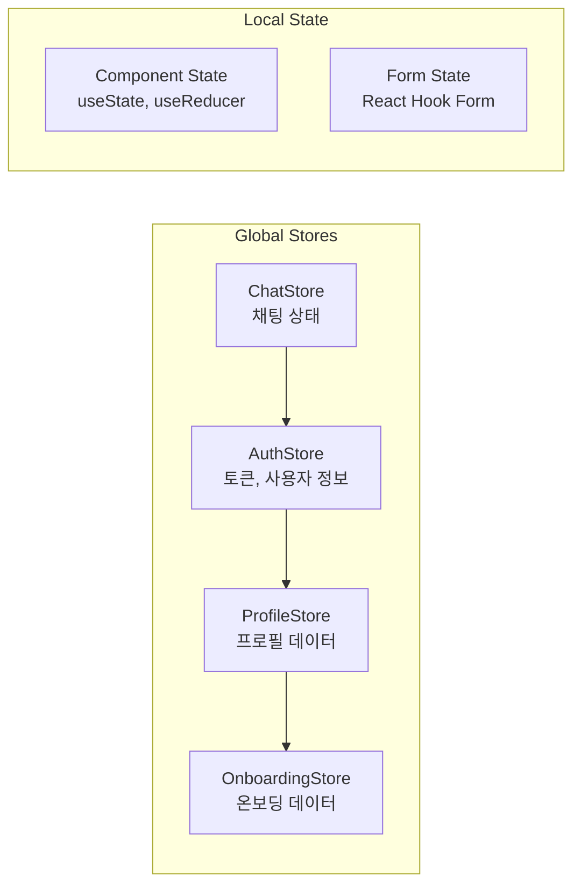

### 컴포넌트 아키텍처 패턴
- **Container-Presenter Pattern**: 비즈니스 로직과 UI 분리
- **Compound Components**: 복합적인 UI 컴포넌트 구조
- **Custom Hooks**: 로직 재사용 및 관심사 분리
- **Higher-Order Components**: 인증, 권한 검사 등

## 🛠️ 백엔드 아키텍처 (STUDYMATE-SERVER)

### Spring Boot 애플리케이션 구조
```
com.studymate/
├── config/              # 설정 클래스
│   ├── SecurityConfig   # 보안 설정
│   ├── WebSocketConfig  # WebSocket 설정
│   ├── RedisConfig      # Redis 설정
│   └── SwaggerConfig    # API 문서 설정
├── common/              # 공통 컴포넌트
│   ├── dto/            # 공통 DTO
│   ├── entity/         # 공통 엔티티
│   └── exception/      # 예외 처리
├── domain/              # 도메인별 패키지
│   ├── user/           # 사용자 관리
│   ├── chat/           # 채팅 시스템
│   ├── onboarding/     # 온보딩
│   ├── clova/          # AI 언어 교정
│   └── matching/       # 매칭 시스템
└── redis/               # Redis 관련
```

### 도메인 기반 구조 (DDD)
```mermaid
graph TD
    subgraph "User Domain"
        U_CTRL[UserController]
        U_SVC[UserService]
        U_REPO[UserRepository]
        U_ENT[User Entity]
    end
    
    subgraph "Chat Domain"
        C_CTRL[ChatController]
        C_SVC[ChatService]
        C_REPO[ChatRepository]
        C_ENT[Chat Entities]
    end
    
    subgraph "Onboarding Domain"
        O_CTRL[OnboardingController]
        O_SVC[OnboardingService]
        O_REPO[OnboardingRepository]
        O_ENT[Onboarding Entities]
    end
    
    U_CTRL --> U_SVC --> U_REPO --> U_ENT
    C_CTRL --> C_SVC --> C_REPO --> C_ENT
    O_CTRL --> O_SVC --> O_REPO --> O_ENT
```

## 📡 통신 아키텍처

### HTTP API 통신
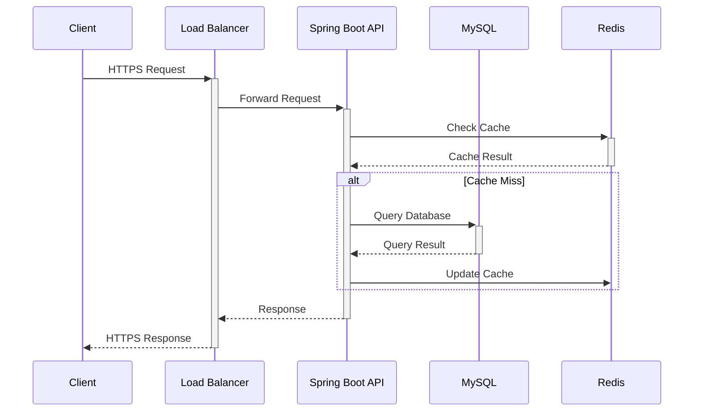

### WebSocket 실시간 통신
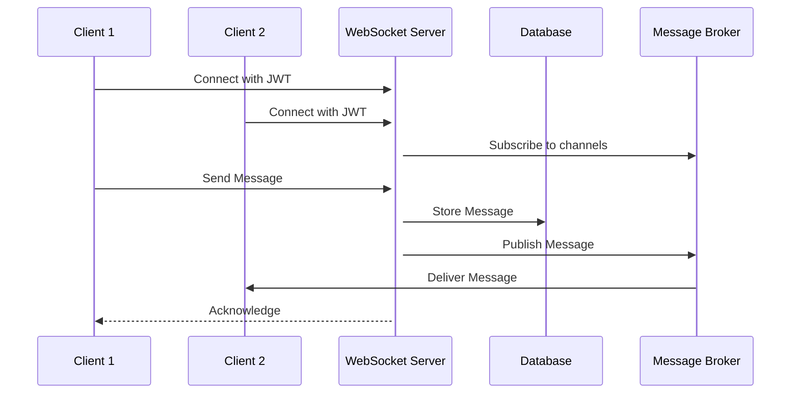

### 외부 API 연동
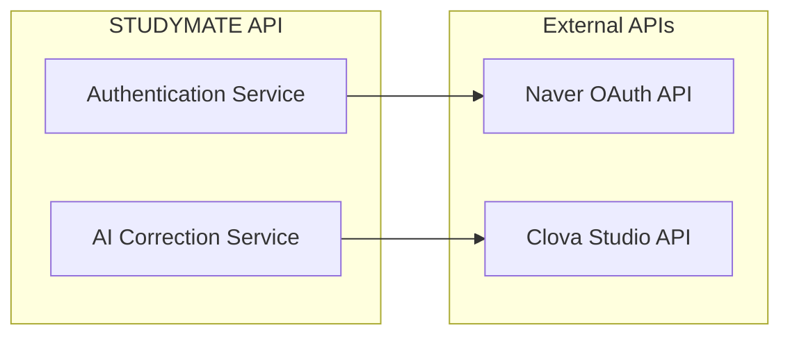

## 💾 데이터 아키텍처

### 데이터베이스 구조
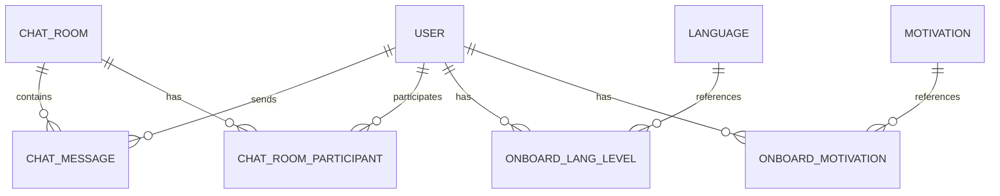

### 캐시 전략 (Redis)
```
Cache Patterns:
├── Session Store: JWT 토큰 및 사용자 세션
├── Database Cache: 자주 조회되는 데이터
│   ├── User Profile (TTL: 1시간)
│   ├── Onboarding Settings (TTL: 30분)
│   └── Chat Room Info (TTL: 15분)
├── Rate Limiting: API 호출 제한
└── WebSocket Sessions: 실시간 연결 정보
```

### 파일 저장소 구조 (NCP Object Storage)
```
studymate-storage/
├── profiles/
│   ├── images/          # 프로필 이미지
│   └── thumbnails/      # 썸네일 이미지
├── chat/
│   ├── images/          # 채팅 이미지
│   └── files/           # 채팅 파일
└── system/
    ├── assets/          # 시스템 자산
    └── backups/         # 백업 파일
```

## 🔐 보안 아키텍처

### 인증 및 권한 관리
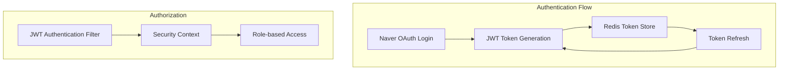

### 보안 계층
```
Security Layers:
├── Network Security
│   ├── HTTPS/TLS 1.3
│   ├── CORS Policy
│   └── Rate Limiting
├── Application Security
│   ├── JWT Authentication
│   ├── Input Validation
│   ├── SQL Injection Prevention
│   └── XSS Protection
├── Data Security
│   ├── Database Encryption (TDE)
│   ├── Password Hashing (bcrypt)
│   └── File Upload Security
└── Infrastructure Security
    ├── VPC Network Isolation
    ├── Firewall Rules
    └── Access Control (IAM)
```

## ⚡ 성능 아키텍처

### CDN 및 캐싱 전략
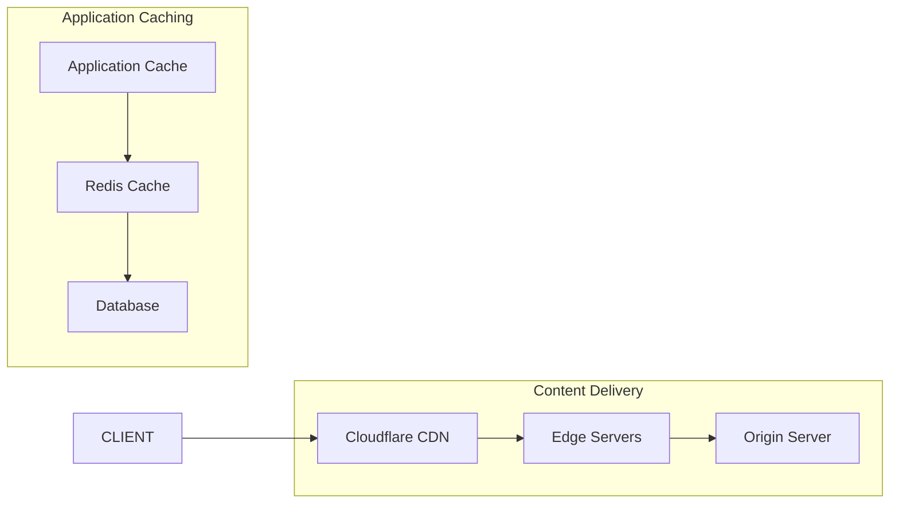

### 로드 밸런싱 및 스케일링
```
Load Balancing Strategy:
├── Frontend: Cloudflare Global Load Balancer
├── API Gateway: NCP Load Balancer (Round Robin)
├── Application: Auto Scaling Group
│   ├── Min Instances: 2
│   ├── Max Instances: 10
│   └── Scaling Metrics: CPU 70%, Memory 80%
└── Database: Read Replicas (Read/Write Splitting)
```

## 🔄 배포 아키텍처

### CI/CD 파이프라인
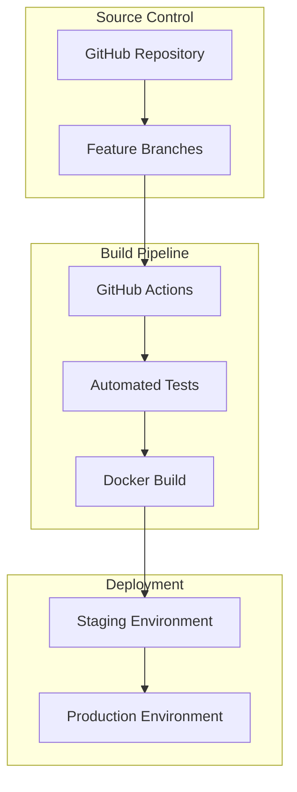

### 환경별 배포 전략
```
Deployment Strategy:
├── Development
│   ├── Local Docker Compose
│   └── Hot Reloading
├── Staging
│   ├── NCP Test Environment
│   ├── Blue-Green Deployment
│   └── Integration Testing
└── Production
    ├── NCP Production Environment
    ├── Rolling Deployment
    ├── Health Checks
    └── Rollback Capability
```

## 📊 모니터링 아키텍처

### 관찰 가능성 (Observability)
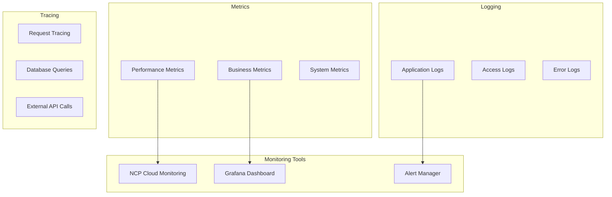

## 🔮 확장 계획

### 단계별 아키텍처 진화
```
Phase 1 (Current): Monolithic API + SPA Client
├── Single Spring Boot Application
├── MySQL + Redis
└── Basic Monitoring

Phase 2 (6 months): Service Decomposition
├── User Service
├── Chat Service
├── Matching Service
└── API Gateway

Phase 3 (1 year): Microservices + Event Driven
├── Event Streaming (Apache Kafka)
├── Service Mesh (Istio)
├── Container Orchestration (Kubernetes)
└── Advanced Monitoring (Jaeger, Prometheus)
```

### 기술 스택 진화 로드맵
- **Frontend**: React → Next.js (SSR)
- **Backend**: Spring Boot → Spring Cloud (Microservices)
- **Database**: MySQL → Multi-database (PostgreSQL, MongoDB)
- **Message Queue**: WebSocket → Apache Kafka
- **Container**: Docker → Kubernetes
- **Monitoring**: Basic → Observability Platform

## 📝 아키텍처 결정 기록 (ADR)

### 주요 기술 선택 사유

1. **React + Vite**: 
   - 빠른 개발 속도와 Hot Reloading
   - 현대적인 번들링 도구
   - 풍부한 생태계

2. **Spring Boot**: 
   - 엔터프라이즈급 안정성
   - 풍부한 기능과 생태계
   - 팀의 Java 전문성

3. **MySQL**: 
   - 관계형 데이터 구조 적합
   - NCP 완전 관리형 서비스
   - 높은 가용성과 백업 지원

4. **Redis**: 
   - 고성능 캐싱
   - WebSocket 세션 관리
   - JWT 토큰 저장소

5. **Cloudflare Pages**: 
   - 글로벌 CDN
   - 자동 HTTPS
   - GitHub 통합 배포

## 🔗 관련 문서

- [API 명세서](../04-api/api-specification.md)
- [데이터베이스 스키마](../05-database/database-schema.md)
- [인프라 가이드](../08-infrastructure/deployment-guide.md)
- [보안 가이드](../08-infrastructure/security-guide.md)