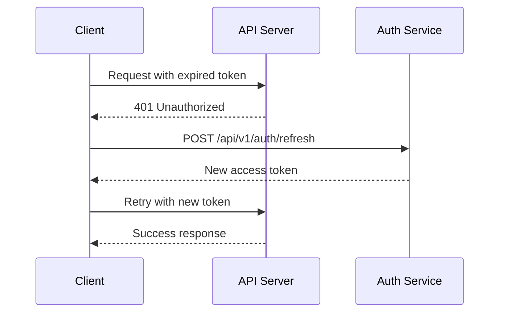

# API 명세서

## 📋 API 개요

본 문서는 STUDYMATE 백엔드 서버(STUDYMATE-SERVER)의 REST API 및 WebSocket API 명세를 정의합니다.

### 기본 정보
- **Base URL**: `https://api.languagemate.kr`
- **Protocol**: HTTPS
- **Content-Type**: `application/json`
- **Authentication**: JWT Bearer Token
- **API Version**: v1

### Swagger 문서
- **Production**: https://api.languagemate.kr/swagger-ui/index.html
- **Local**: http://localhost:8080/swagger-ui/index.html

## 🔐 인증 (Authentication)

### JWT 토큰 사용법
```http
Authorization: Bearer <access_token>
```

### 토큰 갱신 플로우


## 👤 사용자 인증 API

### 1. Naver OAuth 콜백
```http
GET /login/oauth2/code/naver
```

**Query Parameters:**
- `code` (required): Naver OAuth 인증 코드
- `state` (optional): CSRF 방지용 상태값

**Response:**
```json
{
  "success": true,
  "data": {
    "accessToken": "eyJhbGciOiJIUzI1NiIsInR5cCI6IkpXVCJ9...",
    "refreshToken": "dGVzdC1yZWZyZXNoLXRva2Vu...",
    "user": {
      "id": 1,
      "email": "user@naver.com",
      "name": "홍길동",
      "profileImage": null
    }
  }
}
```

### 2. 토큰 갱신
```http
POST /api/v1/auth/refresh
```

**Request Body:**
```json
{
  "refreshToken": "dGVzdC1yZWZyZXNoLXRva2Vu..."
}
```

**Response:**
```json
{
  "success": true,
  "data": {
    "accessToken": "eyJhbGciOiJIUzI1NiIsInR5cCI6IkpXVCJ9...",
    "refreshToken": "dGVzdC1yZWZyZXNoLXRva2Vu..."
  }
}
```

### 3. 로그아웃
```http
POST /api/v1/auth/logout
```

**Headers:** `Authorization: Bearer <token>`

**Response:**
```json
{
  "success": true,
  "message": "Successfully logged out"
}
```

## 👤 사용자 관리 API

### 1. 프로필 조회
```http
GET /api/v1/users/profile
```

**Headers:** `Authorization: Bearer <token>`

**Response:**
```json
{
  "success": true,
  "data": {
    "id": 1,
    "email": "user@naver.com",
    "name": "홍길동",
    "englishName": "John Doe",
    "profileImage": "https://api.languagemate.kr/uploads/profiles/1.jpg",
    "location": "Seoul, South Korea",
    "selfBio": "안녕하세요! 영어를 배우고 있는 개발자입니다.",
    "birthYear": 1990,
    "birthday": "03-15",
    "gender": "MALE",
    "createdAt": "2024-01-01T00:00:00Z"
  }
}
```

### 2. 프로필 수정
```http
PATCH /api/v1/users/profile
```

**Headers:** `Authorization: Bearer <token>`

**Request Body:**
```json
{
  "englishName": "John Doe",
  "location": "Seoul, South Korea",
  "selfBio": "Hello! I'm a developer learning English.",
  "birthYear": 1990,
  "birthday": "03-15",
  "gender": "MALE"
}
```

**Response:**
```json
{
  "success": true,
  "data": {
    "id": 1,
    "englishName": "John Doe",
    "location": "Seoul, South Korea",
    "selfBio": "Hello! I'm a developer learning English."
  }
}
```

### 3. 프로필 이미지 업로드
```http
POST /api/v1/users/profile/image
```

**Headers:** 
- `Authorization: Bearer <token>`
- `Content-Type: multipart/form-data`

**Form Data:**
- `image`: 이미지 파일 (최대 5MB, jpg/png/gif)

**Response:**
```json
{
  "success": true,
  "data": {
    "imageUrl": "https://api.languagemate.kr/uploads/profiles/1.jpg"
  }
}
```

## 🎯 온보딩 API

### 1. 온보딩 상태 조회
```http
GET /api/v1/onboarding/status
```

**Headers:** `Authorization: Bearer <token>`

**Response:**
```json
{
  "success": true,
  "data": {
    "isCompleted": false,
    "currentStep": 2,
    "completedSteps": [1],
    "totalSteps": 4
  }
}
```

### 2. 언어 설정 저장 (1단계)
```http
POST /api/v1/onboarding/step/1
```

**Headers:** `Authorization: Bearer <token>`

**Request Body:**
```json
{
  "languages": [
    {
      "languageId": 1,
      "level": "INTERMEDIATE"
    }
  ],
  "nativeLanguage": "Korean"
}
```

**Response:**
```json
{
  "success": true,
  "message": "Step 1 completed successfully"
}
```

### 3. 관심사 설정 저장 (2단계)
```http
POST /api/v1/onboarding/step/2
```

**Request Body:**
```json
{
  "topics": [1, 3, 5],
  "motivations": [2, 4],
  "learningStyles": [1, 3],
  "communicationMethods": ["TEXT", "VOICE"]
}
```

### 4. 파트너 선호도 저장 (3단계)
```http
POST /api/v1/onboarding/step/3
```

**Request Body:**
```json
{
  "preferredGender": "ANY",
  "preferredPersonalities": [1, 2, 4],
  "groupSize": "ONE_ON_ONE"
}
```

### 5. 스케줄 설정 저장 (4단계)
```http
POST /api/v1/onboarding/step/4
```

**Request Body:**
```json
{
  "schedules": [
    {
      "dayOfWeek": "MONDAY",
      "startTime": "19:00",
      "endTime": "21:00"
    },
    {
      "dayOfWeek": "WEDNESDAY",
      "startTime": "20:00",
      "endTime": "22:00"
    }
  ],
  "dailyMinutes": 60,
  "learningExceptions": ["BUSINESS_TRIP", "EXAM_PERIOD"]
}
```

### 6. 온보딩 완료
```http
POST /api/v1/onboarding/complete
```

**Response:**
```json
{
  "success": true,
  "data": {
    "completedAt": "2024-01-01T12:00:00Z",
    "redirectUrl": "/main"
  }
}
```

## 🤝 매칭 API

### 1. 추천 파트너 목록
```http
GET /api/v1/matching/partners
```

**Query Parameters:**
- `page` (optional): 페이지 번호 (기본값: 0)
- `size` (optional): 페이지 크기 (기본값: 10)
- `location` (optional): 거주지 필터
- `language` (optional): 학습 언어 필터

**Response:**
```json
{
  "success": true,
  "data": {
    "partners": [
      {
        "id": 2,
        "englishName": "Sarah Kim",
        "profileImage": "https://api.languagemate.kr/uploads/profiles/2.jpg",
        "location": "Seoul, South Korea",
        "nativeLanguage": "English",
        "learningLanguage": "Korean",
        "languageLevel": "BEGINNER",
        "matchScore": 85,
        "commonInterests": ["Movies", "Travel", "Technology"]
      }
    ],
    "totalElements": 25,
    "totalPages": 3,
    "currentPage": 0
  }
}
```

### 2. 매칭 요청 전송
```http
POST /api/v1/matching/request
```

**Request Body:**
```json
{
  "targetUserId": 2,
  "message": "안녕하세요! 함께 언어 교환하고 싶어요."
}
```

**Response:**
```json
{
  "success": true,
  "data": {
    "matchRequestId": 123,
    "status": "PENDING",
    "createdAt": "2024-01-01T12:00:00Z"
  }
}
```

### 3. 매칭 요청 수락
```http
POST /api/v1/matching/accept/{matchId}
```

**Response:**
```json
{
  "success": true,
  "data": {
    "matchId": 123,
    "chatRoomId": 456,
    "status": "ACCEPTED"
  }
}
```

### 4. 매칭 요청 거절
```http
POST /api/v1/matching/reject/{matchId}
```

**Response:**
```json
{
  "success": true,
  "message": "Match request rejected"
}
```

## 💬 채팅 API

### 1. 채팅방 목록 조회
```http
GET /api/v1/chat/rooms
```

**Query Parameters:**
- `page` (optional): 페이지 번호
- `size` (optional): 페이지 크기

**Response:**
```json
{
  "success": true,
  "data": {
    "rooms": [
      {
        "id": 456,
        "name": "Sarah Kim",
        "type": "DIRECT",
        "participants": [
          {
            "id": 1,
            "name": "홍길동",
            "profileImage": "https://api.languagemate.kr/uploads/profiles/1.jpg"
          },
          {
            "id": 2,
            "name": "Sarah Kim",
            "profileImage": "https://api.languagemate.kr/uploads/profiles/2.jpg"
          }
        ],
        "lastMessage": {
          "content": "Nice to meet you!",
          "createdAt": "2024-01-01T15:30:00Z",
          "senderName": "Sarah Kim"
        },
        "unreadCount": 2,
        "updatedAt": "2024-01-01T15:30:00Z"
      }
    ],
    "totalElements": 5,
    "currentPage": 0
  }
}
```

### 2. 채팅방 생성
```http
POST /api/v1/chat/rooms
```

**Request Body:**
```json
{
  "participantId": 2,
  "type": "DIRECT"
}
```

**Response:**
```json
{
  "success": true,
  "data": {
    "roomId": 789,
    "participants": [1, 2],
    "createdAt": "2024-01-01T16:00:00Z"
  }
}
```

### 3. 채팅 메시지 조회
```http
GET /api/v1/chat/rooms/{roomId}/messages
```

**Query Parameters:**
- `page` (optional): 페이지 번호
- `size` (optional): 페이지 크기 (기본값: 20)

**Response:**
```json
{
  "success": true,
  "data": {
    "messages": [
      {
        "id": 1001,
        "content": "Hello! Nice to meet you.",
        "messageType": "TEXT",
        "senderId": 2,
        "senderName": "Sarah Kim",
        "createdAt": "2024-01-01T15:25:00Z",
        "readAt": "2024-01-01T15:26:00Z"
      },
      {
        "id": 1002,
        "content": "https://api.languagemate.kr/uploads/chat/image1.jpg",
        "messageType": "IMAGE",
        "senderId": 1,
        "senderName": "홍길동",
        "createdAt": "2024-01-01T15:30:00Z",
        "readAt": null
      }
    ],
    "totalElements": 50,
    "currentPage": 0
  }
}
```

## 🤖 AI 언어 교정 API

### 1. 영어 교정 요청
```http
POST /api/v1/clova/correction
```

**Request Body:**
```json
{
  "text": "I am go to school every day."
}
```

**Response:**
```json
{
  "success": true,
  "data": {
    "originalText": "I am go to school every day.",
    "correctedText": "I go to school every day.",
    "corrections": [
      {
        "type": "GRAMMAR",
        "original": "I am go",
        "corrected": "I go",
        "explanation": "주어가 'I'일 때는 일반동사 'go'를 그대로 사용합니다. 'am going'(현재 진행형) 또는 'go'(현재 시제)가 올바른 형태입니다.",
        "startIndex": 0,
        "endIndex": 6
      }
    ],
    "overallScore": 85,
    "processedAt": "2024-01-01T16:00:00Z"
  }
}
```

## 🌐 WebSocket API

### 연결 정보
- **Endpoint**: `wss://api.languagemate.kr/ws`
- **Protocol**: STOMP over SockJS
- **Authentication**: JWT 토큰을 연결 헤더에 포함

### 연결 방법
```javascript
const socket = new SockJS('https://api.languagemate.kr/ws');
const stompClient = Stomp.over(socket);

stompClient.connect(
  {
    'Authorization': `Bearer ${accessToken}`
  },
  () => {
    console.log('Connected to WebSocket');
  }
);
```

### 구독 채널

#### 1. 개인 메시지 수신
```javascript
stompClient.subscribe('/user/queue/messages', (message) => {
  const data = JSON.parse(message.body);
  console.log('Received private message:', data);
});
```

#### 2. 채팅방 메시지 수신
```javascript
stompClient.subscribe(`/topic/chat/${roomId}`, (message) => {
  const data = JSON.parse(message.body);
  console.log('Received chat message:', data);
});
```

#### 3. 매칭 알림 수신
```javascript
stompClient.subscribe('/user/queue/matching', (message) => {
  const data = JSON.parse(message.body);
  console.log('Received matching notification:', data);
});
```

### 메시지 전송

#### 1. 채팅 메시지 전송
```javascript
stompClient.send('/app/chat/send', {}, JSON.stringify({
  roomId: 456,
  content: 'Hello everyone!',
  messageType: 'TEXT'
}));
```

#### 2. 이미지 메시지 전송
```javascript
stompClient.send('/app/chat/send', {}, JSON.stringify({
  roomId: 456,
  content: 'https://api.languagemate.kr/uploads/chat/image1.jpg',
  messageType: 'IMAGE'
}));
```

#### 3. 타이핑 상태 전송
```javascript
stompClient.send('/app/chat/typing', {}, JSON.stringify({
  roomId: 456,
  isTyping: true
}));
```

### WebSocket 메시지 형식

#### 채팅 메시지
```json
{
  "type": "CHAT_MESSAGE",
  "data": {
    "messageId": 1001,
    "roomId": 456,
    "senderId": 1,
    "senderName": "홍길동",
    "content": "Hello!",
    "messageType": "TEXT",
    "createdAt": "2024-01-01T16:00:00Z"
  }
}
```

#### 타이핑 상태
```json
{
  "type": "TYPING_STATUS",
  "data": {
    "roomId": 456,
    "userId": 1,
    "userName": "홍길동",
    "isTyping": true
  }
}
```

#### 매칭 알림
```json
{
  "type": "MATCH_REQUEST",
  "data": {
    "matchId": 123,
    "fromUserId": 2,
    "fromUserName": "Sarah Kim",
    "message": "Let's practice languages together!",
    "createdAt": "2024-01-01T16:00:00Z"
  }
}
```

## 📊 공통 응답 형식

### 성공 응답
```json
{
  "success": true,
  "data": { ... },
  "message": "Operation completed successfully"
}
```

### 에러 응답
```json
{
  "success": false,
  "error": {
    "code": "INVALID_REQUEST",
    "message": "Request validation failed",
    "details": {
      "field": "email",
      "issue": "Invalid email format"
    }
  },
  "timestamp": "2024-01-01T16:00:00Z"
}
```

### 페이지네이션 응답
```json
{
  "success": true,
  "data": {
    "content": [ ... ],
    "totalElements": 100,
    "totalPages": 10,
    "currentPage": 0,
    "pageSize": 10,
    "hasNext": true,
    "hasPrevious": false
  }
}
```

## 🚫 에러 코드

### HTTP 상태 코드
- `200 OK`: 요청 성공
- `201 Created`: 리소스 생성 성공
- `400 Bad Request`: 잘못된 요청
- `401 Unauthorized`: 인증 실패
- `403 Forbidden`: 권한 없음
- `404 Not Found`: 리소스를 찾을 수 없음
- `409 Conflict`: 리소스 충돌
- `422 Unprocessable Entity`: 유효성 검사 실패
- `500 Internal Server Error`: 서버 내부 오류

### 커스텀 에러 코드
```json
{
  "AUTH_001": "Invalid JWT token",
  "AUTH_002": "Token expired",
  "AUTH_003": "Refresh token not found",
  "USER_001": "User not found",
  "USER_002": "Email already exists",
  "MATCH_001": "Already matched with this user",
  "MATCH_002": "Cannot match with yourself",
  "CHAT_001": "Chat room not found",
  "CHAT_002": "Not a member of this chat room",
  "FILE_001": "File too large",
  "FILE_002": "Unsupported file type",
  "CLOVA_001": "AI service temporarily unavailable",
  "ONBOARD_001": "Onboarding step not completed"
}
```

## 🔧 Rate Limiting

### 제한 정책
- **일반 API**: 분당 100회
- **파일 업로드**: 분당 10회
- **AI 교정**: 분당 20회
- **WebSocket 메시지**: 초당 10회

### Rate Limit 헤더
```http
X-RateLimit-Limit: 100
X-RateLimit-Remaining: 95
X-RateLimit-Reset: 1640995200
```

## 🧪 테스트 환경

### 테스트 데이터
- **테스트 사용자**: test@example.com
- **테스트 토큰**: 개발 환경에서 제공
- **Mock 데이터**: Swagger UI에서 제공

### API 테스트 도구
- **Swagger UI**: 브라우저에서 직접 테스트
- **Postman Collection**: API 테스트 컬렉션 제공
- **curl 예제**: 문서 내 포함

## 📝 변경 이력

| 버전 | 날짜 | 변경사항 | 작성자 |
|------|------|----------|--------|
| 1.0 | 2024-01-XX | 초기 API 명세 작성 | Backend Team |

## 🔗 관련 문서

- [프론트엔드 API 연동 가이드](../06-frontend/api-integration.md)
- [인증 가이드](../08-infrastructure/authentication-guide.md)
- [WebSocket 구현 가이드](../07-backend/websocket-guide.md)
- [에러 처리 가이드](../07-backend/error-handling.md)