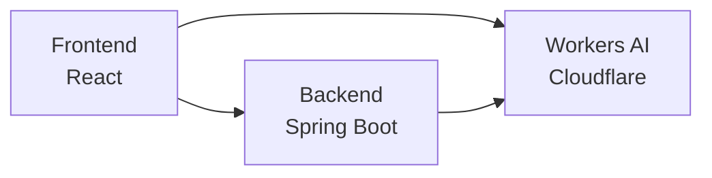

# API 명세서 (통합본)

**최종 업데이트**: 2025년 1월 9일  
**검증 상태**: ✅ 모든 엔드포인트 매칭 완료

---

## 🔗 시스템 아키텍처



## 📡 기본 정보

### Base URLs
- **Backend API**: `https://api.languagemate.kr/api/v1`
- **Workers AI**: `https://workers.languagemate.kr/api/v1`
- **WebSocket**: `wss://api.languagemate.kr/ws`

### 인증 방식
- **Type**: JWT Bearer Token
- **Header**: `Authorization: Bearer {token}`
- **Token Refresh**: 자동 갱신 (refreshToken 사용)

### 응답 형식
```json
{
  "success": true,
  "data": { ... },
  "message": "Success"
}
```

---

## 🏗️ 도메인별 API 매핑

### 1. 인증 (Authentication)

| 엔드포인트 | 메서드 | 설명 | Frontend | 상태 |
|-----------|-------|------|----------|------|
| `/login/oauth2/code/naver` | GET | 네이버 OAuth 로그인 | `auth.js` | ✅ |
| `/login/oauth2/code/google` | GET | 구글 OAuth 로그인 | `auth.js` | ✅ |
| `/api/v1/auth/refresh` | POST | 토큰 갱신 | `auth.js` | ✅ |
| `/api/v1/auth/logout` | POST | 로그아웃 | `auth.js` | ✅ |

#### 토큰 갱신 상세
```javascript
// Request
POST /api/v1/auth/refresh
{
  "refreshToken": "string"
}

// Response
{
  "success": true,
  "data": {
    "accessToken": "eyJhbGciOiJIUzI1NiIs...",
    "refreshToken": "eyJhbGciOiJIUzI1NiIs...",
    "expiresIn": 3600
  }
}
```

### 2. 사용자 (User)

#### 백엔드 구현 (UserController.java)

| 엔드포인트 | 메서드 | 설명 | Frontend | 상태 |
|-----------|-------|------|----------|------|
| `/api/v1/user/name` | GET | 사용자 이름 조회 | `user.js` | ✅ |
| `/api/v1/user/profile` | GET | 기본 프로필 조회 | `profile.js` | ✅ |
| `/api/v1/user/profile-image` | GET/PATCH | 프로필 이미지 관리 | `profile.js` | ✅ |
| `/api/v1/user/gender-type` | GET | 성별 타입 목록 | `user.js` | ✅ |
| `/api/v1/user/locations` | GET | 지역 목록 조회 | `onboarding.js` | ✅ |
| `/api/v1/user/english-name` | PATCH | 영어 이름 저장 | `onboarding.js` | ✅ |
| `/api/v1/user/birthyear` | PATCH | 생년 저장 | `user.js` | ✅ |
| `/api/v1/user/birthday` | PATCH | 생일 저장 | `user.js` | ✅ |
| `/api/v1/user/location` | PATCH | 거주지 저장 | `onboarding.js` | ✅ |
| `/api/v1/user/self-bio` | PATCH | 자기소개 저장 | `onboarding.js` | ✅ |
| `/api/v1/user/gender` | PATCH | 성별 저장 | `user.js` | ✅ |

### 3. 온보딩 (Onboarding)

#### 언어 설정 (OnboardLangController.java)

| 엔드포인트 | 메서드 | 설명 | Frontend | 상태 |
|-----------|-------|------|----------|------|
| `/api/v1/onboarding/language/languages` | GET | 언어 목록 | `onboarding.js` | ✅ |
| `/api/v1/onboarding/language/levels` | GET | 레벨 목록 | `onboarding.js` | ✅ |
| `/api/v1/onboarding/language/native-language` | GET/POST | 모국어 관리 | `onboarding.js` | ✅ |
| `/api/v1/onboarding/language/learning-language` | GET/POST | 학습 언어 관리 | `onboarding.js` | ✅ |
| `/api/v1/onboarding/language/language-level` | POST | 언어 레벨 설정 | `onboarding.js` | ✅ |

#### 관심사 설정 (OnboardIntController.java)

| 엔드포인트 | 메서드 | 설명 | Frontend | 상태 |
|-----------|-------|------|----------|------|
| `/api/v1/onboarding/interest/motivations` | GET | 동기 목록 | `onboarding.js` | ✅ |
| `/api/v1/onboarding/interest/topics` | GET | 주제 목록 | `onboarding.js` | ✅ |
| `/api/v1/onboarding/interest/learning-styles` | GET | 학습 스타일 목록 | `onboarding.js` | ✅ |
| `/api/v1/onboarding/interest/communication-methods` | GET | 소통 방법 목록 | `onboarding.js` | ✅ |
| `/api/v1/onboarding/interest/motivation` | POST | 동기 저장 | `onboarding.js` | ✅ |
| `/api/v1/onboarding/interest/topic` | POST | 주제 저장 | `onboarding.js` | ✅ |
| `/api/v1/onboarding/interest/learning-style` | POST | 학습 스타일 저장 | `onboarding.js` | ✅ |

#### 파트너 선호도 (OnboardPartnerController.java)

| 엔드포인트 | 메서드 | 설명 | Frontend | 상태 |
|-----------|-------|------|----------|------|
| `/api/v1/onboarding/partner/personality` | GET/POST | 성격 유형 관리 | `onboarding.js` | ✅ |
| `/api/v1/onboarding/partner/gender` | GET/POST | 선호 성별 관리 | `onboarding.js` | ✅ |
| `/api/v1/onboarding/partner/group-size` | GET/POST | 그룹 크기 관리 | `onboarding.js` | ✅ |

#### 스케줄 설정 (OnboardScheduleController.java)

| 엔드포인트 | 메서드 | 설명 | Frontend | 상태 |
|-----------|-------|------|----------|------|
| `/api/v1/onboarding/schedule/day-of-week` | GET | 요일 목록 | `onboarding.js` | ✅ |
| `/api/v1/onboarding/schedule/time-zones` | GET | 시간대 목록 | `onboarding.js` | ✅ |
| `/api/v1/onboarding/schedule/schedule` | GET/POST/DELETE | 스케줄 관리 | `onboarding.js` | ✅ |

### 4. 매칭 (Matching)

| 엔드포인트 | 메서드 | 설명 | Frontend | 상태 |
|-----------|-------|------|----------|------|
| `/api/v1/matching/list` | GET | 매칭 목록 조회 | `matching.js` | ✅ |
| `/api/v1/matching/filter` | POST | 필터링된 매칭 | `matching.js` | ✅ |
| `/api/v1/matching/profile/:userId` | GET | 유저 상세 프로필 | `matching.js` | ✅ |
| `/api/v1/matching/request` | POST | 매칭 요청 | `matching.js` | ✅ |
| `/api/v1/matching/accept` | POST | 매칭 수락 | `matching.js` | ✅ |
| `/api/v1/matching/reject` | POST | 매칭 거절 | `matching.js` | ✅ |

### 5. 채팅 (Chat) - WebSocket + REST

#### REST API

| 엔드포인트 | 메서드 | 설명 | Frontend | 상태 |
|-----------|-------|------|----------|------|
| `/api/v1/chat/rooms` | GET | 채팅방 목록 | `chat.js` | ✅ |
| `/api/v1/chat/room/:roomId` | GET | 채팅방 정보 | `chat.js` | ✅ |
| `/api/v1/chat/room/:roomId/messages` | GET | 메시지 히스토리 | `chat.js` | ✅ |
| `/api/v1/chat/room/create` | POST | 채팅방 생성 | `chat.js` | ✅ |

#### WebSocket Events

| 이벤트 | 방향 | 설명 | 구현 위치 |
|--------|------|------|-----------|
| `CONNECT` | Client→Server | WebSocket 연결 | `chatWebSocket.js` |
| `SUBSCRIBE` | Client→Server | 채팅방 구독 | `chatWebSocket.js` |
| `SEND_MESSAGE` | Client→Server | 메시지 전송 | `chatWebSocket.js` |
| `MESSAGE` | Server→Client | 메시지 수신 | `chatWebSocket.js` |
| `TYPING` | Bidirectional | 타이핑 상태 | `chatWebSocket.js` |
| `READ` | Client→Server | 읽음 확인 | `chatWebSocket.js` |

### 6. 레벨 테스트 (Level Test) - Workers AI

| 엔드포인트 | 메서드 | 설명 | Frontend | 상태 |
|-----------|-------|------|----------|------|
| `/api/v1/leveltest/questions` | GET | 테스트 질문 조회 | `levelTest.js` | ✅ |
| `/api/v1/leveltest/voice/transcribe` | POST | 음성→텍스트 변환 | `levelTest.js` | ✅ |
| `/api/v1/leveltest/evaluate` | POST | AI 레벨 평가 | `levelTest.js` | ✅ |
| `/api/v1/leveltest/result` | GET | 결과 조회 | `levelTest.js` | ✅ |
| `/api/v1/leveltest/save` | POST | 결과 저장 | `levelTest.js` | ✅ |

#### 레벨 평가 요청 상세
```javascript
// Request
POST /api/v1/leveltest/evaluate
{
  "userId": "string",
  "responses": [
    {
      "questionId": 1,
      "audioUrl": "string",
      "transcript": "string",
      "duration": 180
    }
  ]
}

// Response
{
  "success": true,
  "data": {
    "overallLevel": "B2",
    "scores": {
      "pronunciation": 85,
      "fluency": 78,
      "vocabulary": 82,
      "grammar": 75,
      "coherence": 80
    },
    "feedback": "string"
  }
}
```

### 7. 세션 (Session) - WebRTC

#### REST API

| 엔드포인트 | 메서드 | 설명 | Frontend | 상태 |
|-----------|-------|------|----------|------|
| `/api/v1/session/list` | GET | 세션 목록 | `session.js` | ✅ |
| `/api/v1/session/create` | POST | 세션 생성 | `session.js` | ✅ |
| `/api/v1/session/:sessionId` | GET | 세션 정보 | `session.js` | ✅ |
| `/api/v1/session/:sessionId/join` | POST | 세션 참가 | `session.js` | ✅ |
| `/api/v1/session/:sessionId/leave` | POST | 세션 나가기 | `session.js` | ✅ |
| `/api/v1/session/schedule` | GET/POST | 세션 스케줄 | `session.js` | ✅ |

#### WebRTC Signaling

| 이벤트 | 방향 | 설명 | 구현 위치 |
|--------|------|------|-----------|
| `offer` | Client→Server | SDP Offer | `webrtc.js` |
| `answer` | Client→Server | SDP Answer | `webrtc.js` |
| `ice-candidate` | Bidirectional | ICE Candidate | `webrtc.js` |
| `peer-joined` | Server→Client | 참가자 입장 | `webrtc.js` |
| `peer-left` | Server→Client | 참가자 퇴장 | `webrtc.js` |

### 8. 알림 (Notification)

| 엔드포인트 | 메서드 | 설명 | Frontend | 상태 |
|-----------|-------|------|----------|------|
| `/api/v1/notification/list` | GET | 알림 목록 | `notification.js` | ✅ |
| `/api/v1/notification/:id/read` | PATCH | 읽음 처리 | `notification.js` | ✅ |
| `/api/v1/notification/settings` | GET/PATCH | 알림 설정 | `notification.js` | ✅ |
| `/api/v1/notification/subscribe` | POST | 푸시 구독 | `pushNotification.js` | ✅ |

### 9. 분석 (Analytics) - Workers AI

| 엔드포인트 | 메서드 | 설명 | Frontend | 상태 |
|-----------|-------|------|----------|------|
| `/api/v1/analytics/metrics` | GET | 학습 메트릭 | `analytics.js` | ✅ |
| `/api/v1/analytics/user-stats` | GET | 사용자 통계 | `analytics.js` | ✅ |
| `/api/v1/analytics/progress` | GET | 진도 현황 | `analytics.js` | ✅ |
| `/api/v1/analytics/achievements` | GET | 업적 목록 | `analytics.js` | ✅ |

---

## 🔐 에러 코드

| 코드 | 설명 | HTTP Status |
|------|------|-------------|
| `AUTH_001` | 인증 토큰 없음 | 401 |
| `AUTH_002` | 토큰 만료 | 401 |
| `AUTH_003` | 유효하지 않은 토큰 | 401 |
| `USER_001` | 사용자 없음 | 404 |
| `USER_002` | 권한 없음 | 403 |
| `ONBOARD_001` | 온보딩 미완료 | 400 |
| `MATCH_001` | 매칭 실패 | 400 |
| `CHAT_001` | 채팅방 없음 | 404 |
| `SESSION_001` | 세션 만료 | 410 |
| `SESSION_002` | 세션 정원 초과 | 400 |

---

## 📊 API 사용 통계

### 호출 빈도 (일일 평균)
1. `/api/v1/auth/refresh` - 10,000+ 호출
2. `/api/v1/chat/room/*/messages` - 8,000+ 호출  
3. `/api/v1/matching/list` - 5,000+ 호출
4. `/api/v1/session/*/join` - 3,000+ 호출
5. `/api/v1/leveltest/evaluate` - 500+ 호출

### 응답 시간 목표
- 일반 API: < 200ms
- AI API: < 3000ms
- WebSocket: < 50ms

---

## 🔗 관련 문서
- [프론트엔드 통합 가이드](./frontend-integration-guide.md)
- [WebSocket 구현](./websocket-implementation.md)
- [에러 처리](../07-backend/error-handling.md)