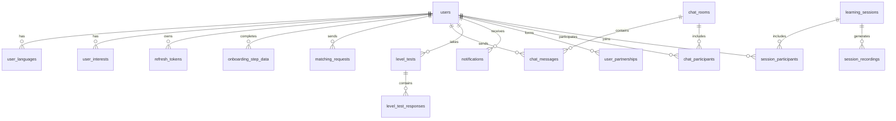

# STUDYMATE 데이터베이스 설계

**최종 업데이트**: 2025-01-13

## 📋 개요

STUDYMATE 플랫폼의 데이터베이스 구조와 엔터티 간의 관계를 정의합니다. 이 문서는 Cloudflare D1 (SQLite 기반) 관계형 데이터베이스를 기반으로 합니다.

## 🏗️ 데이터베이스 아키텍처

### 기술 스택
- **주 데이터베이스**: Cloudflare D1 (SQLite 기반)
- **캐시 레이어**: Workers KV / Durable Objects
- **객체 스토리지**: R2 (이미지, 음성 파일)
- **데이터 접근**: Hono 서비스 + 직접 SQL / Drizzle ORM
- **마이그레이션**: `wrangler d1 migrations`

### 데이터베이스 구성
```
STUDYMATE API Database (Cloudflare D1)
├── 사용자 관리 (User Management)
├── 인증 및 세션 (Authentication & Sessions)
├── 온보딩 시스템 (Onboarding System)
├── 언어 및 레벨 (Languages & Levels)
├── 매칭 시스템 (Matching System)
├── 채팅 시스템 (Chat System)
├── 세션 관리 (Session Management)
├── 레벨 테스트 (Level Test)
├── 알림 시스템 (Notification System)
└── 분석 및 통계 (Analytics)
```

## 📊 ERD (Entity Relationship Diagram)

### 주요 관계


## 👤 사용자 관리 도메인

### users (사용자)
```sql
CREATE TABLE users (
    id                  BIGSERIAL PRIMARY KEY,
    email              VARCHAR(255) UNIQUE NOT NULL,
    english_name       VARCHAR(100) NOT NULL,
    korean_name        VARCHAR(100),
    birth_date         DATE NOT NULL,
    gender             VARCHAR(20) CHECK (gender IN ('MALE', 'FEMALE', 'OTHER')),
    residence          VARCHAR(255),
    profile_image_url  TEXT,
    intro              TEXT,
    is_active          BOOLEAN DEFAULT true,
    oauth_provider     VARCHAR(50) CHECK (oauth_provider IN ('GOOGLE', 'NAVER')),
    oauth_id           VARCHAR(255),
    created_at         TIMESTAMP WITH TIME ZONE DEFAULT CURRENT_TIMESTAMP,
    updated_at         TIMESTAMP WITH TIME ZONE DEFAULT CURRENT_TIMESTAMP,

    CONSTRAINT unique_oauth_user UNIQUE (oauth_provider, oauth_id)
);

CREATE INDEX idx_users_email ON users(email);
CREATE INDEX idx_users_oauth ON users(oauth_provider, oauth_id);
```

### user_languages (사용자 언어 설정)
```sql
CREATE TABLE user_languages (
    id                 BIGSERIAL PRIMARY KEY,
    user_id           BIGINT NOT NULL REFERENCES users(id) ON DELETE CASCADE,
    language_code     VARCHAR(10) NOT NULL, -- 'ko', 'en', 'zh', 'ja', 'es', 'fr'
    language_type     VARCHAR(20) NOT NULL CHECK (language_type IN ('NATIVE', 'TEACHING', 'LEARNING')),
    proficiency_level VARCHAR(10) CHECK (proficiency_level IN ('A1', 'A2', 'B1', 'B2', 'C1', 'C2')),
    is_primary        BOOLEAN DEFAULT false,
    created_at        TIMESTAMP WITH TIME ZONE DEFAULT CURRENT_TIMESTAMP,

    CONSTRAINT unique_user_language UNIQUE (user_id, language_code, language_type)
);

CREATE INDEX idx_user_languages_user ON user_languages(user_id);
```

### user_interests (사용자 관심사)
```sql
CREATE TABLE user_interests (
    id            BIGSERIAL PRIMARY KEY,
    user_id      BIGINT NOT NULL REFERENCES users(id) ON DELETE CASCADE,
    interest_tag VARCHAR(100) NOT NULL,
    created_at   TIMESTAMP WITH TIME ZONE DEFAULT CURRENT_TIMESTAMP,

    CONSTRAINT unique_user_interest UNIQUE (user_id, interest_tag)
);

CREATE INDEX idx_user_interests_user ON user_interests(user_id);
```

## 🔐 인증 및 세션

### refresh_tokens (리프레시 토큰)
```sql
CREATE TABLE refresh_tokens (
    id           BIGSERIAL PRIMARY KEY,
    user_id     BIGINT NOT NULL REFERENCES users(id) ON DELETE CASCADE,
    token       VARCHAR(255) UNIQUE NOT NULL,
    expires_at  TIMESTAMP WITH TIME ZONE NOT NULL,
    is_used     BOOLEAN DEFAULT false,
    created_at  TIMESTAMP WITH TIME ZONE DEFAULT CURRENT_TIMESTAMP
);

CREATE INDEX idx_refresh_tokens_token ON refresh_tokens(token);
CREATE INDEX idx_refresh_tokens_user_active ON refresh_tokens(user_id, expires_at, is_used);
```

### user_sessions (사용자 세션)
```sql
CREATE TABLE user_sessions (
    id                BIGSERIAL PRIMARY KEY,
    user_id          BIGINT NOT NULL REFERENCES users(id) ON DELETE CASCADE,
    session_token    VARCHAR(255) UNIQUE NOT NULL,
    ip_address       INET,
    user_agent       TEXT,
    expires_at       TIMESTAMP WITH TIME ZONE NOT NULL,
    last_activity_at TIMESTAMP WITH TIME ZONE DEFAULT CURRENT_TIMESTAMP,
    is_active        BOOLEAN DEFAULT true,
    created_at       TIMESTAMP WITH TIME ZONE DEFAULT CURRENT_TIMESTAMP
);

CREATE INDEX idx_user_sessions_token ON user_sessions(session_token);
CREATE INDEX idx_user_sessions_user_active ON user_sessions(user_id, is_active, expires_at);
```

## 🎯 온보딩 시스템

### onboarding_progress (온보딩 진행 상황)
```sql
CREATE TABLE onboarding_progress (
    id             BIGSERIAL PRIMARY KEY,
    user_id       BIGINT NOT NULL REFERENCES users(id) ON DELETE CASCADE,
    current_step  INTEGER DEFAULT 1 CHECK (current_step BETWEEN 1 AND 6),
    is_completed  BOOLEAN DEFAULT false,
    completed_at  TIMESTAMP WITH TIME ZONE,
    created_at    TIMESTAMP WITH TIME ZONE DEFAULT CURRENT_TIMESTAMP,
    updated_at    TIMESTAMP WITH TIME ZONE DEFAULT CURRENT_TIMESTAMP,

    CONSTRAINT unique_user_onboarding UNIQUE (user_id)
);
```

### onboarding_step_data (온보딩 단계별 데이터)
```sql
CREATE TABLE onboarding_step_data (
    id         BIGSERIAL PRIMARY KEY,
    user_id   BIGINT NOT NULL REFERENCES users(id) ON DELETE CASCADE,
    step_num  INTEGER NOT NULL CHECK (step_num BETWEEN 1 AND 6),
    data_json JSONB NOT NULL,
    created_at TIMESTAMP WITH TIME ZONE DEFAULT CURRENT_TIMESTAMP,

    CONSTRAINT unique_user_step UNIQUE (user_id, step_num)
);
```

## 💑 매칭 시스템

### matching_requests (매칭 요청)
```sql
CREATE TABLE matching_requests (
    id           BIGSERIAL PRIMARY KEY,
    requester_id BIGINT NOT NULL REFERENCES users(id) ON DELETE CASCADE,
    target_id    BIGINT NOT NULL REFERENCES users(id) ON DELETE CASCADE,
    message      TEXT,
    status       VARCHAR(20) DEFAULT 'PENDING'
                 CHECK (status IN ('PENDING', 'ACCEPTED', 'REJECTED', 'EXPIRED')),
    expires_at   TIMESTAMP WITH TIME ZONE NOT NULL,
    responded_at TIMESTAMP WITH TIME ZONE,
    created_at   TIMESTAMP WITH TIME ZONE DEFAULT CURRENT_TIMESTAMP,

    CONSTRAINT different_users CHECK (requester_id != target_id)
);

CREATE INDEX idx_matching_requests_target_pending ON matching_requests(target_id, status, expires_at);
CREATE INDEX idx_matching_requests_requester_status ON matching_requests(requester_id, status);
```

### user_partnerships (사용자 파트너십)
```sql
CREATE TABLE user_partnerships (
    id                BIGSERIAL PRIMARY KEY,
    user_id_1        BIGINT NOT NULL REFERENCES users(id) ON DELETE CASCADE,
    user_id_2        BIGINT NOT NULL REFERENCES users(id) ON DELETE CASCADE,
    partnership_type VARCHAR(20) DEFAULT 'CASUAL'
                     CHECK (partnership_type IN ('CASUAL', 'REGULAR')),
    compatibility_score INTEGER CHECK (compatibility_score BETWEEN 0 AND 100),
    total_sessions   INTEGER DEFAULT 0,
    last_session_at  TIMESTAMP WITH TIME ZONE,
    is_active        BOOLEAN DEFAULT true,
    created_at       TIMESTAMP WITH TIME ZONE DEFAULT CURRENT_TIMESTAMP,

    CONSTRAINT different_partners CHECK (user_id_1 != user_id_2),
    CONSTRAINT unique_partnership UNIQUE (user_id_1, user_id_2)
);

CREATE INDEX idx_user_partnerships_user1_active ON user_partnerships(user_id_1, is_active);
CREATE INDEX idx_user_partnerships_user2_activity ON user_partnerships(user_id_2, is_active, last_session_at);
```

### matching_preferences (매칭 선호도)
```sql
CREATE TABLE matching_preferences (
    id                    BIGSERIAL PRIMARY KEY,
    user_id              BIGINT NOT NULL REFERENCES users(id) ON DELETE CASCADE,
    preferred_age_min    INTEGER CHECK (preferred_age_min >= 13),
    preferred_age_max    INTEGER CHECK (preferred_age_max <= 100),
    preferred_gender     VARCHAR(20) CHECK (preferred_gender IN ('MALE', 'FEMALE', 'ANY')),
    preferred_countries  TEXT[], -- Array of country codes
    min_compatibility    INTEGER DEFAULT 70 CHECK (min_compatibility BETWEEN 0 AND 100),
    max_distance_km      INTEGER, -- For location-based matching
    created_at           TIMESTAMP WITH TIME ZONE DEFAULT CURRENT_TIMESTAMP,
    updated_at           TIMESTAMP WITH TIME ZONE DEFAULT CURRENT_TIMESTAMP,

    CONSTRAINT unique_user_preferences UNIQUE (user_id),
    CONSTRAINT valid_age_range CHECK (preferred_age_min <= preferred_age_max)
);
```

## 💬 채팅 시스템

### chat_rooms (채팅방)
```sql
CREATE TABLE chat_rooms (
    id                  BIGSERIAL PRIMARY KEY,
    room_type          VARCHAR(20) DEFAULT 'DIRECT'
                       CHECK (room_type IN ('DIRECT', 'GROUP')),
    name               VARCHAR(255),
    description        TEXT,
    created_by_user_id BIGINT REFERENCES users(id) ON DELETE SET NULL,
    is_active          BOOLEAN DEFAULT true,
    last_message_at    TIMESTAMP WITH TIME ZONE,
    created_at         TIMESTAMP WITH TIME ZONE DEFAULT CURRENT_TIMESTAMP,
    updated_at         TIMESTAMP WITH TIME ZONE DEFAULT CURRENT_TIMESTAMP
);

CREATE INDEX idx_chat_rooms_activity ON chat_rooms(is_active, last_message_at);
CREATE INDEX idx_chat_rooms_created_by ON chat_rooms(created_by_user_id);
```

### chat_participants (채팅 참가자)
```sql
CREATE TABLE chat_participants (
    id                     BIGSERIAL PRIMARY KEY,
    room_id               BIGINT NOT NULL REFERENCES chat_rooms(id) ON DELETE CASCADE,
    user_id               BIGINT NOT NULL REFERENCES users(id) ON DELETE CASCADE,
    role                  VARCHAR(20) DEFAULT 'MEMBER'
                          CHECK (role IN ('ADMIN', 'MEMBER')),
    joined_at             TIMESTAMP WITH TIME ZONE DEFAULT CURRENT_TIMESTAMP,
    last_read_message_id  BIGINT,
    is_active             BOOLEAN DEFAULT true,

    CONSTRAINT unique_room_participant UNIQUE (room_id, user_id)
);

CREATE INDEX idx_chat_participants_user_rooms ON chat_participants(user_id, is_active);
CREATE INDEX idx_chat_participants_room ON chat_participants(room_id, is_active);
```

### chat_messages (채팅 메시지)
```sql
CREATE TABLE chat_messages (
    id              BIGSERIAL PRIMARY KEY,
    room_id        BIGINT NOT NULL REFERENCES chat_rooms(id) ON DELETE CASCADE,
    sender_id      BIGINT NOT NULL REFERENCES users(id) ON DELETE CASCADE,
    message_type   VARCHAR(20) DEFAULT 'TEXT'
                   CHECK (message_type IN ('TEXT', 'IMAGE', 'VOICE', 'FILE', 'SYSTEM')),
    content        TEXT,
    file_url       TEXT,
    file_metadata  JSONB, -- Size, type, etc.
    reply_to_id    BIGINT REFERENCES chat_messages(id),
    is_edited      BOOLEAN DEFAULT false,
    edited_at      TIMESTAMP WITH TIME ZONE,
    created_at     TIMESTAMP WITH TIME ZONE DEFAULT CURRENT_TIMESTAMP
);

CREATE INDEX idx_chat_messages_room ON chat_messages(room_id, created_at);
CREATE INDEX idx_chat_messages_sender ON chat_messages(sender_id, created_at);
CREATE INDEX idx_chat_messages_reply ON chat_messages(reply_to_id);
```

## 📞 세션 관리

### learning_sessions (학습 세션)
```sql
CREATE TABLE learning_sessions (
    id                    BIGSERIAL PRIMARY KEY,
    session_type         VARCHAR(20) NOT NULL
                         CHECK (session_type IN ('AUDIO_1V1', 'VIDEO_1V1', 'GROUP_VIDEO')),
    title                VARCHAR(255),
    description          TEXT,
    scheduled_start_time TIMESTAMP WITH TIME ZONE NOT NULL,
    scheduled_end_time   TIMESTAMP WITH TIME ZONE NOT NULL,
    actual_start_time    TIMESTAMP WITH TIME ZONE,
    actual_end_time      TIMESTAMP WITH TIME ZONE,
    status               VARCHAR(20) DEFAULT 'SCHEDULED'
                         CHECK (status IN ('SCHEDULED', 'IN_PROGRESS', 'COMPLETED', 'CANCELLED')),
    room_id              VARCHAR(255), -- WebRTC room ID
    primary_language     VARCHAR(10), -- Language code for first half
    secondary_language   VARCHAR(10), -- Language code for second half
    max_participants     INTEGER DEFAULT 2 CHECK (max_participants BETWEEN 2 AND 4),
    created_by_user_id   BIGINT REFERENCES users(id) ON DELETE SET NULL,
    created_at           TIMESTAMP WITH TIME ZONE DEFAULT CURRENT_TIMESTAMP,
    updated_at           TIMESTAMP WITH TIME ZONE DEFAULT CURRENT_TIMESTAMP
);

CREATE INDEX idx_learning_sessions_schedule ON learning_sessions(scheduled_start_time, scheduled_end_time);
CREATE INDEX idx_learning_sessions_status ON learning_sessions(status, scheduled_start_time);
CREATE INDEX idx_learning_sessions_room ON learning_sessions(room_id);
```

### session_participants (세션 참가자)
```sql
CREATE TABLE session_participants (
    id               BIGSERIAL PRIMARY KEY,
    session_id      BIGINT NOT NULL REFERENCES learning_sessions(id) ON DELETE CASCADE,
    user_id         BIGINT NOT NULL REFERENCES users(id) ON DELETE CASCADE,
    role            VARCHAR(20) DEFAULT 'PARTICIPANT'
                    CHECK (role IN ('HOST', 'PARTICIPANT')),
    joined_at       TIMESTAMP WITH TIME ZONE,
    left_at         TIMESTAMP WITH TIME ZONE,
    participation_time INTEGER DEFAULT 0, -- In seconds
    rating_given    INTEGER CHECK (rating_given BETWEEN 1 AND 5),
    feedback        TEXT,
    is_confirmed    BOOLEAN DEFAULT false,
    created_at      TIMESTAMP WITH TIME ZONE DEFAULT CURRENT_TIMESTAMP,

    CONSTRAINT unique_session_participant UNIQUE (session_id, user_id)
);

CREATE INDEX idx_session_participants_user ON session_participants(user_id, created_at);
CREATE INDEX idx_session_participants_session ON session_participants(session_id, role);
```

### session_recordings (세션 녹화)
```sql
CREATE TABLE session_recordings (
    id           BIGSERIAL PRIMARY KEY,
    session_id  BIGINT NOT NULL REFERENCES learning_sessions(id) ON DELETE CASCADE,
    file_url    TEXT NOT NULL,
    file_size   BIGINT, -- In bytes
    duration    INTEGER, -- In seconds
    format      VARCHAR(20), -- 'MP4', 'WEBM', etc.
    quality     VARCHAR(20), -- 'HD', 'SD', etc.
    is_available BOOLEAN DEFAULT true,
    expires_at   TIMESTAMP WITH TIME ZONE, -- Auto-deletion date
    created_at   TIMESTAMP WITH TIME ZONE DEFAULT CURRENT_TIMESTAMP
);

CREATE INDEX idx_session_recordings_session ON session_recordings(session_id);
CREATE INDEX idx_session_recordings_expiry ON session_recordings(expires_at, is_available);
```

## 🎯 레벨 테스트 시스템

### level_tests (레벨 테스트)
```sql
CREATE TABLE level_tests (
    id                  BIGSERIAL PRIMARY KEY,
    user_id            BIGINT NOT NULL REFERENCES users(id) ON DELETE CASCADE,
    language_code      VARCHAR(10) NOT NULL,
    test_type          VARCHAR(20) DEFAULT 'FULL'
                       CHECK (test_type IN ('FULL', 'QUICK', 'RETAKE')),
    status             VARCHAR(20) DEFAULT 'IN_PROGRESS'
                       CHECK (status IN ('IN_PROGRESS', 'COMPLETED', 'FAILED')),
    overall_level      VARCHAR(10) CHECK (overall_level IN ('A1', 'A2', 'B1', 'B2', 'C1', 'C2')),
    overall_score      INTEGER CHECK (overall_score BETWEEN 0 AND 100),
    pronunciation_score INTEGER CHECK (pronunciation_score BETWEEN 0 AND 100),
    grammar_score      INTEGER CHECK (grammar_score BETWEEN 0 AND 100),
    fluency_score      INTEGER CHECK (fluency_score BETWEEN 0 AND 100),
    vocabulary_score   INTEGER CHECK (vocabulary_score BETWEEN 0 AND 100),
    comprehension_score INTEGER CHECK (comprehension_score BETWEEN 0 AND 100),
    interaction_score  INTEGER CHECK (interaction_score BETWEEN 0 AND 100),
    feedback_text      TEXT,
    ai_analysis        JSONB, -- Detailed AI analysis data
    started_at         TIMESTAMP WITH TIME ZONE DEFAULT CURRENT_TIMESTAMP,
    completed_at       TIMESTAMP WITH TIME ZONE
);

CREATE INDEX idx_level_tests_user_tests ON level_tests(user_id, language_code, completed_at);
CREATE INDEX idx_level_tests_level_distribution ON level_tests(language_code, overall_level);
```

### level_test_responses (레벨 테스트 응답)
```sql
CREATE TABLE level_test_responses (
    id               BIGSERIAL PRIMARY KEY,
    test_id         BIGINT NOT NULL REFERENCES level_tests(id) ON DELETE CASCADE,
    question_number INTEGER NOT NULL CHECK (question_number BETWEEN 1 AND 4),
    question_text   TEXT NOT NULL,
    audio_url       TEXT, -- URL to recorded response
    transcription   TEXT, -- AI transcription of the audio
    duration_seconds INTEGER,
    ai_scores       JSONB, -- Detailed scoring from AI
    created_at      TIMESTAMP WITH TIME ZONE DEFAULT CURRENT_TIMESTAMP,

    CONSTRAINT unique_test_question UNIQUE (test_id, question_number)
);

CREATE INDEX idx_level_test_responses_test ON level_test_responses(test_id, question_number);
```

## 🔔 알림 시스템

### notifications (알림)
```sql
CREATE TABLE notifications (
    id            BIGSERIAL PRIMARY KEY,
    user_id      BIGINT NOT NULL REFERENCES users(id) ON DELETE CASCADE,
    type         VARCHAR(50) NOT NULL,
    title        VARCHAR(255) NOT NULL,
    message      TEXT NOT NULL,
    data_json    JSONB, -- Additional data for the notification
    is_read      BOOLEAN DEFAULT false,
    read_at      TIMESTAMP WITH TIME ZONE,
    priority     VARCHAR(20) DEFAULT 'NORMAL'
                 CHECK (priority IN ('LOW', 'NORMAL', 'HIGH', 'URGENT')),
    expires_at   TIMESTAMP WITH TIME ZONE,
    created_at   TIMESTAMP WITH TIME ZONE DEFAULT CURRENT_TIMESTAMP
);

CREATE INDEX idx_notifications_user ON notifications(user_id, is_read, created_at);
CREATE INDEX idx_notifications_type ON notifications(type, created_at);
CREATE INDEX idx_notifications_expiry ON notifications(expires_at);
```

### push_subscriptions (푸시 구독)
```sql
CREATE TABLE push_subscriptions (
    id           BIGSERIAL PRIMARY KEY,
    user_id     BIGINT NOT NULL REFERENCES users(id) ON DELETE CASCADE,
    endpoint    TEXT UNIQUE NOT NULL,
    p256dh_key  TEXT NOT NULL,
    auth_key    TEXT NOT NULL,
    user_agent  TEXT,
    is_active   BOOLEAN DEFAULT true,
    created_at  TIMESTAMP WITH TIME ZONE DEFAULT CURRENT_TIMESTAMP,
    updated_at  TIMESTAMP WITH TIME ZONE DEFAULT CURRENT_TIMESTAMP
);

CREATE INDEX idx_push_subscriptions_user ON push_subscriptions(user_id, is_active);
```

## 📊 분석 및 통계

### user_activity_logs (사용자 활동 로그)
```sql
CREATE TABLE user_activity_logs (
    id          BIGSERIAL PRIMARY KEY,
    user_id    BIGINT REFERENCES users(id) ON DELETE SET NULL,
    activity   VARCHAR(100) NOT NULL,
    details    JSONB,
    ip_address INET,
    user_agent TEXT,
    created_at TIMESTAMP WITH TIME ZONE DEFAULT CURRENT_TIMESTAMP
);

CREATE INDEX idx_user_activity_logs_user ON user_activity_logs(user_id, created_at);
CREATE INDEX idx_user_activity_logs_activity ON user_activity_logs(activity, created_at);
```

### learning_analytics (학습 분석)
```sql
CREATE TABLE learning_analytics (
    id                     BIGSERIAL PRIMARY KEY,
    user_id               BIGINT NOT NULL REFERENCES users(id) ON DELETE CASCADE,
    language_code         VARCHAR(10) NOT NULL,
    date                  DATE NOT NULL,
    total_session_time    INTEGER DEFAULT 0, -- In seconds
    session_count         INTEGER DEFAULT 0,
    messages_sent         INTEGER DEFAULT 0,
    level_improvements    INTEGER DEFAULT 0,
    badges_earned         INTEGER DEFAULT 0,
    average_session_rating DECIMAL(3,2),
    created_at            TIMESTAMP WITH TIME ZONE DEFAULT CURRENT_TIMESTAMP,

    CONSTRAINT unique_user_date_lang UNIQUE (user_id, language_code, date)
);

CREATE INDEX idx_learning_analytics_user ON learning_analytics(user_id, language_code, date);
CREATE INDEX idx_learning_analytics_date ON learning_analytics(date, language_code);
```

### system_metrics (시스템 메트릭)
```sql
CREATE TABLE system_metrics (
    id             BIGSERIAL PRIMARY KEY,
    metric_name   VARCHAR(100) NOT NULL,
    metric_value  DECIMAL(15,4) NOT NULL,
    metric_unit   VARCHAR(20),
    tags          JSONB, -- Additional metadata
    recorded_at   TIMESTAMP WITH TIME ZONE DEFAULT CURRENT_TIMESTAMP
);

CREATE INDEX idx_system_metrics_time ON system_metrics(metric_name, recorded_at);
CREATE INDEX idx_system_metrics_tags ON system_metrics USING gin(tags);
```

## 🔗 Workers KV 스키마

Workers KV는 고속 키-값 저장소로 다음 데이터에 사용됩니다:

### 세션 관리
```typescript
// Key: session:{userId}
interface SessionCache {
    accessToken: string;
    refreshToken: string;
    expiresAt: number; // Unix timestamp
}
// TTL: 7 days
```

### 온라인 상태
```typescript
// Key: online:{userId}
interface OnlineStatus {
    status: 'online' | 'away' | 'busy';
    lastSeen: number; // Unix timestamp
}
// TTL: 30 minutes
```

### 채팅 캐시
```typescript
// Key: chat:unread:{userId}:{roomId}
// Value: number (unread count)

// Key: chat:typing:{roomId}:{userId}
// Value: true
// TTL: 10 seconds
```

### 레벨 테스트 임시 저장
```typescript
// Key: leveltest:temp:{userId}
interface LevelTestTemp {
    audioData: string; // base64
    transcript: string;
    timestamp: number;
}
// TTL: 1 hour
```

## 📈 성능 최적화 전략

### 인덱스 최적화
```sql
-- 채팅 성능 최적화
CREATE INDEX CONCURRENTLY idx_chat_messages_room_time
ON chat_messages(room_id, created_at DESC);

-- 매칭 성능 최적화
CREATE INDEX CONCURRENTLY idx_matching_active_requests
ON matching_requests(target_id, status, expires_at)
WHERE status = 'PENDING';

-- 세션 스케줄링 최적화
CREATE INDEX CONCURRENTLY idx_sessions_upcoming
ON learning_sessions(scheduled_start_time)
WHERE status IN ('SCHEDULED', 'IN_PROGRESS');

-- 알림 성능 최적화
CREATE INDEX CONCURRENTLY idx_notifications_unread
ON notifications(user_id, created_at DESC)
WHERE is_read = false;
```

### 캐싱 전략

#### 1. Workers KV (분산 캐싱)
- 사용자 세션 정보
- 온라인 상태
- 자주 조회되는 설정 데이터

#### 2. Durable Objects (상태 관리)
- WebRTC 룸 상태
- 채팅방 실시간 상태
- 사용자 Presence 정보

#### 3. R2 (객체 스토리지)
- 프로필 이미지
- 음성 파일 (레벨 테스트, 음성 메시지)
- 세션 녹화 파일

## 🔧 데이터베이스 제약 조건

### 체크 제약 조건
```sql
-- 나이 유효성 검사
ALTER TABLE users ADD CONSTRAINT valid_birth_date
CHECK (birth_date > '1900-01-01' AND birth_date < CURRENT_DATE - INTERVAL '13 years');

-- 세션 시간 유효성 검사
ALTER TABLE learning_sessions ADD CONSTRAINT valid_session_duration
CHECK (scheduled_end_time > scheduled_start_time);

-- 점수 범위 검사
ALTER TABLE level_tests ADD CONSTRAINT valid_scores
CHECK (overall_score IS NULL OR
       (pronunciation_score + grammar_score + fluency_score +
        vocabulary_score + comprehension_score + interaction_score) / 6 = overall_score);
```

## 📊 확장성 고려사항

### 수직 확장 (Scale Up)
- **연결 풀 최적화**: 최적화된 연결 풀 설정
- **쿼리 최적화**: EXPLAIN ANALYZE 활용한 성능 튜닝
- **인덱스 최적화**: 주기적인 인덱스 재구성

### 수평 확장 (Scale Out)
- **Cloudflare Workers**: 자동 글로벌 분산 및 확장
- **D1 읽기 복제본**: 읽기 전용 쿼리 분산 (향후)
- **샤딩 준비**: user_id 기반 데이터 분산 준비
- **캐싱 전략**: Workers KV를 활용한 빈번한 조회 데이터 캐싱

### 아카이빙 전략
```sql
-- 오래된 데이터 아카이빙
CREATE TABLE chat_messages_archive (LIKE chat_messages);
CREATE TABLE user_activity_logs_archive (LIKE user_activity_logs);

-- 정기적 아카이빙 (6개월 이상 된 데이터)
-- Cloudflare Workers Cron Trigger로 실행
```

## 🔄 마이그레이션 관리

### Wrangler D1 마이그레이션
```bash
# 새 마이그레이션 생성
wrangler d1 migrations create <database-name> <migration-name>

# 마이그레이션 적용
wrangler d1 migrations apply <database-name>

# 마이그레이션 상태 확인
wrangler d1 migrations list <database-name>
```

### 마이그레이션 파일 구조
```
.wrangler/migrations/
├── 0001_init_schema.sql
├── 0002_add_oauth_tables.sql
├── 0003_add_chat_tables.sql
├── 0004_add_leveltest_tables.sql
└── 0005_add_indexes.sql
```

---

*이 데이터베이스 설계는 STUDYMATE 시스템의 데이터 구조를 정의하며, 서비스 확장에 따라 지속적으로 업데이트됩니다. 모든 변경사항은 마이그레이션 스크립트를 통해 버전 관리됩니다.*
