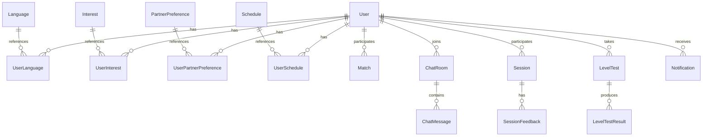

# 데이터베이스 스키마

## 📊 ERD (Entity Relationship Diagram)



## 📋 테이블 명세

### 1. users (사용자)
```sql
CREATE TABLE users (
    id BINARY(16) PRIMARY KEY,
    email VARCHAR(255) UNIQUE,
    english_name VARCHAR(100),
    korean_name VARCHAR(100),
    profile_image VARCHAR(500),
    introduction TEXT,
    birth_year INT,
    birth_day VARCHAR(5),
    location_id INT,
    native_language_id INT,
    onboarding_completed BOOLEAN DEFAULT FALSE,
    is_active BOOLEAN DEFAULT TRUE,
    last_login_at TIMESTAMP,
    created_at TIMESTAMP DEFAULT CURRENT_TIMESTAMP,
    updated_at TIMESTAMP DEFAULT CURRENT_TIMESTAMP ON UPDATE CURRENT_TIMESTAMP,
    
    INDEX idx_email (email),
    INDEX idx_english_name (english_name),
    INDEX idx_location (location_id),
    INDEX idx_native_language (native_language_id)
);
```

### 2. oauth_users (OAuth 인증)
```sql
CREATE TABLE oauth_users (
    id BIGINT AUTO_INCREMENT PRIMARY KEY,
    user_id BINARY(16),
    provider VARCHAR(50),
    provider_id VARCHAR(255),
    access_token TEXT,
    refresh_token TEXT,
    token_expires_at TIMESTAMP,
    created_at TIMESTAMP DEFAULT CURRENT_TIMESTAMP,
    
    FOREIGN KEY (user_id) REFERENCES users(id),
    UNIQUE KEY uk_provider_id (provider, provider_id),
    INDEX idx_user_id (user_id)
);
```

### 3. languages (언어)
```sql
CREATE TABLE languages (
    id INT AUTO_INCREMENT PRIMARY KEY,
    code VARCHAR(10) UNIQUE,
    name VARCHAR(100),
    native_name VARCHAR(100),
    is_active BOOLEAN DEFAULT TRUE
);
```

### 4. user_languages (사용자 언어)
```sql
CREATE TABLE user_languages (
    id BIGINT AUTO_INCREMENT PRIMARY KEY,
    user_id BINARY(16),
    language_id INT,
    is_native BOOLEAN DEFAULT FALSE,
    current_level VARCHAR(10),
    target_level VARCHAR(10),
    created_at TIMESTAMP DEFAULT CURRENT_TIMESTAMP,
    
    FOREIGN KEY (user_id) REFERENCES users(id),
    FOREIGN KEY (language_id) REFERENCES languages(id),
    INDEX idx_user_language (user_id, language_id)
);
```

### 5. interests (관심사)
```sql
CREATE TABLE interests (
    id INT AUTO_INCREMENT PRIMARY KEY,
    category VARCHAR(50),
    name VARCHAR(100),
    name_ko VARCHAR(100),
    description TEXT,
    is_active BOOLEAN DEFAULT TRUE
);
```

### 6. user_interests (사용자 관심사)
```sql
CREATE TABLE user_interests (
    id BIGINT AUTO_INCREMENT PRIMARY KEY,
    user_id BINARY(16),
    interest_id INT,
    interest_type VARCHAR(50), -- motivation, topic, learning_style, expectation
    created_at TIMESTAMP DEFAULT CURRENT_TIMESTAMP,
    
    FOREIGN KEY (user_id) REFERENCES users(id),
    FOREIGN KEY (interest_id) REFERENCES interests(id),
    INDEX idx_user_interest (user_id, interest_type)
);
```

### 7. matches (매칭)
```sql
CREATE TABLE matches (
    id BIGINT AUTO_INCREMENT PRIMARY KEY,
    requester_id BINARY(16),
    receiver_id BINARY(16),
    status VARCHAR(20), -- pending, accepted, rejected, cancelled
    message TEXT,
    matched_at TIMESTAMP,
    created_at TIMESTAMP DEFAULT CURRENT_TIMESTAMP,
    updated_at TIMESTAMP DEFAULT CURRENT_TIMESTAMP ON UPDATE CURRENT_TIMESTAMP,
    
    FOREIGN KEY (requester_id) REFERENCES users(id),
    FOREIGN KEY (receiver_id) REFERENCES users(id),
    INDEX idx_requester (requester_id),
    INDEX idx_receiver (receiver_id),
    INDEX idx_status (status)
);
```

### 8. chat_rooms (채팅방)
```sql
CREATE TABLE chat_rooms (
    id VARCHAR(36) PRIMARY KEY,
    room_name VARCHAR(200),
    room_type VARCHAR(20), -- DIRECT, GROUP
    max_participants INT DEFAULT 2,
    is_public BOOLEAN DEFAULT FALSE,
    created_by BINARY(16),
    created_at TIMESTAMP DEFAULT CURRENT_TIMESTAMP,
    updated_at TIMESTAMP DEFAULT CURRENT_TIMESTAMP ON UPDATE CURRENT_TIMESTAMP,
    
    FOREIGN KEY (created_by) REFERENCES users(id),
    INDEX idx_room_type (room_type),
    INDEX idx_created_by (created_by)
);
```

### 9. chat_room_participants (채팅방 참여자)
```sql
CREATE TABLE chat_room_participants (
    id BIGINT AUTO_INCREMENT PRIMARY KEY,
    room_id VARCHAR(36),
    user_id BINARY(16),
    joined_at TIMESTAMP DEFAULT CURRENT_TIMESTAMP,
    last_read_at TIMESTAMP,
    is_active BOOLEAN DEFAULT TRUE,
    
    FOREIGN KEY (room_id) REFERENCES chat_rooms(id),
    FOREIGN KEY (user_id) REFERENCES users(id),
    UNIQUE KEY uk_room_user (room_id, user_id),
    INDEX idx_user_rooms (user_id)
);
```

### 10. chat_messages (채팅 메시지)
```sql
CREATE TABLE chat_messages (
    id BIGINT AUTO_INCREMENT PRIMARY KEY,
    room_id VARCHAR(36),
    sender_id BINARY(16),
    message_type VARCHAR(20), -- TEXT, IMAGE, FILE
    content TEXT,
    file_url VARCHAR(500),
    is_deleted BOOLEAN DEFAULT FALSE,
    created_at TIMESTAMP DEFAULT CURRENT_TIMESTAMP,
    
    FOREIGN KEY (room_id) REFERENCES chat_rooms(id),
    FOREIGN KEY (sender_id) REFERENCES users(id),
    INDEX idx_room_messages (room_id, created_at),
    INDEX idx_sender (sender_id)
);
```

### 11. sessions (학습 세션)
```sql
CREATE TABLE sessions (
    id BIGINT AUTO_INCREMENT PRIMARY KEY,
    host_id BINARY(16),
    participant_id BINARY(16),
    session_type VARCHAR(20), -- VIDEO, AUDIO
    status VARCHAR(20), -- SCHEDULED, ONGOING, COMPLETED, CANCELLED
    scheduled_at TIMESTAMP,
    started_at TIMESTAMP,
    ended_at TIMESTAMP,
    duration_minutes INT,
    created_at TIMESTAMP DEFAULT CURRENT_TIMESTAMP,
    
    FOREIGN KEY (host_id) REFERENCES users(id),
    FOREIGN KEY (participant_id) REFERENCES users(id),
    INDEX idx_host (host_id),
    INDEX idx_participant (participant_id),
    INDEX idx_scheduled (scheduled_at),
    INDEX idx_status (status)
);
```

### 12. level_tests (레벨 테스트)
```sql
CREATE TABLE level_tests (
    id BIGINT AUTO_INCREMENT PRIMARY KEY,
    user_id BINARY(16),
    language_id INT,
    test_type VARCHAR(20), -- SPEAKING, WRITING
    audio_url VARCHAR(500),
    transcript TEXT,
    test_date TIMESTAMP DEFAULT CURRENT_TIMESTAMP,
    
    FOREIGN KEY (user_id) REFERENCES users(id),
    FOREIGN KEY (language_id) REFERENCES languages(id),
    INDEX idx_user_tests (user_id, test_date)
);
```

### 13. level_test_results (레벨 테스트 결과)
```sql
CREATE TABLE level_test_results (
    id BIGINT AUTO_INCREMENT PRIMARY KEY,
    test_id BIGINT,
    cefr_level VARCHAR(10),
    overall_score INT,
    pronunciation_score INT,
    fluency_score INT,
    grammar_score INT,
    vocabulary_score INT,
    strengths TEXT,
    weaknesses TEXT,
    recommendations JSON,
    feedback TEXT,
    analyzed_at TIMESTAMP DEFAULT CURRENT_TIMESTAMP,
    
    FOREIGN KEY (test_id) REFERENCES level_tests(id),
    INDEX idx_test_result (test_id)
);
```

### 14. notifications (알림)
```sql
CREATE TABLE notifications (
    id BIGINT AUTO_INCREMENT PRIMARY KEY,
    user_id BINARY(16),
    type VARCHAR(50),
    title VARCHAR(200),
    content TEXT,
    related_id VARCHAR(100),
    is_read BOOLEAN DEFAULT FALSE,
    read_at TIMESTAMP,
    created_at TIMESTAMP DEFAULT CURRENT_TIMESTAMP,
    
    FOREIGN KEY (user_id) REFERENCES users(id),
    INDEX idx_user_notifications (user_id, is_read, created_at)
);
```

### 15. locations (위치/시간대)
```sql
CREATE TABLE locations (
    id INT AUTO_INCREMENT PRIMARY KEY,
    country VARCHAR(100),
    city VARCHAR(100),
    timezone VARCHAR(50),
    utc_offset INT,
    is_active BOOLEAN DEFAULT TRUE,
    
    INDEX idx_country_city (country, city)
);
```

## 🗄️ Redis 스키마

### 세션 관리
```
session:{userId} = {
    accessToken: string,
    refreshToken: string,
    expiresAt: timestamp
}
TTL: 7 days
```

### 온라인 상태
```
online:{userId} = {
    status: "online|away|busy",
    lastSeen: timestamp
}
TTL: 30 minutes
```

### 채팅 캐시
```
chat:unread:{userId}:{roomId} = count
chat:typing:{roomId}:{userId} = true
TTL: 10 seconds
```

### 레벨 테스트 임시 저장
```
leveltest:temp:{userId} = {
    audioData: base64,
    transcript: string,
    timestamp: timestamp
}
TTL: 1 hour
```

## 📈 인덱스 전략

### 성능 최적화 인덱스
1. **사용자 검색**: `idx_email`, `idx_english_name`
2. **매칭 조회**: `idx_requester`, `idx_receiver`, `idx_status`
3. **채팅 조회**: `idx_room_messages`, `idx_user_rooms`
4. **세션 조회**: `idx_scheduled`, `idx_status`
5. **알림 조회**: `idx_user_notifications`

### 복합 인덱스
```sql
-- 매칭 검색 최적화
CREATE INDEX idx_match_search ON matches(status, created_at DESC);

-- 채팅 메시지 페이징
CREATE INDEX idx_chat_paging ON chat_messages(room_id, created_at DESC);

-- 알림 조회 최적화
CREATE INDEX idx_notification_unread ON notifications(user_id, is_read, created_at DESC);
```

## 🔄 마이그레이션

### Flyway 마이그레이션 파일 구조
```
src/main/resources/db/migration/
├── V1__init_schema.sql
├── V2__add_oauth_tables.sql
├── V3__add_chat_tables.sql
├── V4__add_leveltest_tables.sql
└── V5__add_indexes.sql
```