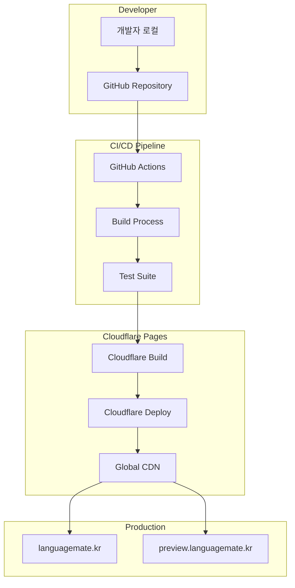

# 배포 가이드 (Deployment Guide)

## 📋 배포 개요

본 문서는 STUDYMATE-CLIENT의 프로덕션 배포 과정과 인프라 설정에 대한 상세 가이드입니다.

## 🏗️ 인프라 아키텍처

### 전체 배포 구조


## 🌐 Cloudflare Pages 설정

### 프로젝트 설정
```yaml
# Cloudflare Pages 설정
Project Name: studymate-client
Build Command: npm run build
Build Output Directory: dist
Root Directory: /
Node.js Version: 18.x

# Environment Variables (Production)
VITE_API_URL: https://api.languagemate.kr
VITE_WS_URL: wss://api.languagemate.kr/ws
VITE_ENV: production

# Environment Variables (Preview)
VITE_API_URL: https://api-staging.languagemate.kr
VITE_WS_URL: wss://api-staging.languagemate.kr/ws
VITE_ENV: staging
```

### 도메인 설정
```bash
# Custom Domains
Production: languagemate.kr
Preview: preview.languagemate.kr

# SSL/TLS
Mode: Full (strict)
Always Use HTTPS: Enabled
Minimum TLS Version: 1.2
```

### Build 설정
```yaml
# Build Configuration
Build System: v2
Build Image: default

# Build Commands
Install Command: npm ci
Build Command: npm run build
Output Directory: dist

# Node.js Settings
Node.js Version: 18.17.1
Package Manager: npm
```

## 🔄 CI/CD 파이프라인

### GitHub Actions Workflow
```yaml
# .github/workflows/deploy.yml
name: Deploy to Cloudflare Pages

on:
  push:
    branches: [main, develop]
  pull_request:
    branches: [main]

jobs:
  build-and-deploy:
    runs-on: ubuntu-latest
    
    steps:
      - name: Checkout
        uses: actions/checkout@v4
        
      - name: Setup Node.js
        uses: actions/setup-node@v4
        with:
          node-version: '18'
          cache: 'npm'
          
      - name: Install dependencies
        run: npm ci
        
      - name: Run tests
        run: npm run test
        
      - name: Run linting
        run: npm run lint
        
      - name: Build project
        run: npm run build
        env:
          VITE_API_URL: ${{ secrets.VITE_API_URL }}
          VITE_WS_URL: ${{ secrets.VITE_WS_URL }}
          
      - name: Deploy to Cloudflare Pages
        uses: cloudflare/pages-action@v1
        with:
          apiToken: ${{ secrets.CLOUDFLARE_API_TOKEN }}
          accountId: ${{ secrets.CLOUDFLARE_ACCOUNT_ID }}
          projectName: studymate-client
          directory: dist
          branch: ${{ github.ref_name }}
```

### 브랜치별 배포 전략
```yaml
# Branch Deployment Strategy
main:
  target: Production (languagemate.kr)
  environment: production
  auto_deploy: true
  
develop:
  target: Preview (preview.languagemate.kr)
  environment: staging
  auto_deploy: true
  
feature/*:
  target: Preview URL
  environment: preview
  auto_deploy: on_pull_request
```

## 📦 빌드 프로세스

### 로컬 빌드
```bash
# 개발 환경 실행
npm run dev

# 프로덕션 빌드
npm run build

# 빌드 미리보기
npm run preview

# 타입 체크
npm run typecheck

# 린팅
npm run lint

# 테스트 실행
npm run test
```

### 빌드 최적화
```javascript
// vite.config.js
import { defineConfig } from 'vite';
import react from '@vitejs/plugin-react';

export default defineConfig({
  plugins: [react()],
  build: {
    outDir: 'dist',
    sourcemap: false,
    minify: 'terser',
    rollupOptions: {
      output: {
        manualChunks: {
          vendor: ['react', 'react-dom'],
          ui: ['@headlessui/react', 'lucide-react'],
          utils: ['axios', 'zustand', 'jwt-decode']
        }
      }
    }
  },
  define: {
    'process.env': process.env
  }
});
```

## 🔐 환경 변수 관리

### 환경별 변수 설정
```bash
# .env.local (개발환경)
VITE_API_URL=http://localhost:8080
VITE_WS_URL=ws://localhost:8080/ws
VITE_ENV=development

# .env.staging (스테이징)
VITE_API_URL=https://api-staging.languagemate.kr
VITE_WS_URL=wss://api-staging.languagemate.kr/ws
VITE_ENV=staging

# .env.production (프로덕션)
VITE_API_URL=https://api.languagemate.kr
VITE_WS_URL=wss://api.languagemate.kr/ws
VITE_ENV=production
```

### GitHub Secrets 설정
```bash
# GitHub Repository Secrets
CLOUDFLARE_API_TOKEN=your_cloudflare_api_token
CLOUDFLARE_ACCOUNT_ID=your_cloudflare_account_id
VITE_API_URL=https://api.languagemate.kr
VITE_WS_URL=wss://api.languagemate.kr/ws

# 민감하지 않은 변수는 환경별 설정 파일 사용
```

## 🚀 배포 명령어

### Wrangler CLI를 사용한 수동 배포
```bash
# Wrangler 설치 및 로그인
npm install -g wrangler
wrangler login

# 프로덕션 배포
npm run build
wrangler pages deploy dist --project-name=studymate-client --branch=main

# 프리뷰 배포
npm run build
wrangler pages deploy dist --project-name=studymate-client --branch=preview

# 배포 상태 확인
wrangler pages deployment list --project-name=studymate-client
```

### 배포 스크립트
```json
{
  "scripts": {
    "deploy:prod": "npm run build && wrangler pages deploy dist --project-name=studymate-client --branch=main",
    "deploy:staging": "npm run build && wrangler pages deploy dist --project-name=studymate-client --branch=develop",
    "deploy:preview": "npm run build && wrangler pages deploy dist --project-name=studymate-client"
  }
}
```

## 🔍 배포 후 검증

### 자동 검증 스크립트
```bash
#!/bin/bash
# deploy-check.sh

echo "🚀 Starting deployment verification..."

# Health check
echo "📡 Checking site availability..."
curl -f https://languagemate.kr || exit 1

# Performance check
echo "⚡ Running Lighthouse audit..."
lighthouse https://languagemate.kr --chrome-flags="--headless" --output=json --quiet

# API connectivity check
echo "🔌 Testing API connectivity..."
curl -f https://api.languagemate.kr/health || exit 1

echo "✅ Deployment verification completed successfully!"
```

### 수동 검증 체크리스트
- [ ] 사이트 접속 가능 (https://languagemate.kr)
- [ ] 네이버 OAuth 로그인 작동
- [ ] API 통신 정상 작동
- [ ] WebSocket 연결 성공
- [ ] 반응형 디자인 확인 (모바일/태블릿/데스크톱)
- [ ] 주요 기능 테스트 (로그인, 온보딩, 채팅)
- [ ] 성능 메트릭 확인 (Core Web Vitals)
- [ ] 에러 로그 확인

## 📊 모니터링 및 로그

### Cloudflare Analytics
```bash
# 사용 가능한 메트릭
- Page Views
- Unique Visitors
- Bandwidth Usage
- Geographic Distribution
- Device Types
- Performance Metrics

# 알림 설정
- 트래픽 급증 알림
- 에러율 상승 알림
- 성능 저하 알림
```

### 에러 추적
```javascript
// src/utils/errorTracking.js
export const trackError = (error, context) => {
  // 프로덕션 환경에서만 에러 추적
  if (import.meta.env.VITE_ENV === 'production') {
    // Sentry, LogRocket 등 에러 추적 서비스 연동
    console.error('Production Error:', error, context);
  }
};

// 전역 에러 핸들러
window.addEventListener('error', (event) => {
  trackError(event.error, {
    message: event.message,
    filename: event.filename,
    lineno: event.lineno,
    colno: event.colno
  });
});

window.addEventListener('unhandledrejection', (event) => {
  trackError(event.reason, {
    type: 'unhandledrejection',
    promise: event.promise
  });
});
```

## 🔧 성능 최적화

### Build 최적화
```javascript
// vite.config.js - 성능 최적화 설정
export default defineConfig({
  build: {
    target: 'es2015',
    cssCodeSplit: true,
    rollupOptions: {
      output: {
        manualChunks(id) {
          if (id.includes('node_modules')) {
            if (id.includes('react')) return 'react';
            if (id.includes('lucide')) return 'icons';
            if (id.includes('date')) return 'date';
            return 'vendor';
          }
        }
      }
    }
  },
  define: {
    __DEV__: JSON.stringify(false)
  }
});
```

### 캐싱 전략
```javascript
// sw.js - Service Worker 캐싱
const CACHE_NAME = 'studymate-v1';
const urlsToCache = [
  '/',
  '/static/css/main.css',
  '/static/js/main.js',
  '/fonts/Pretendard.woff2'
];

self.addEventListener('install', (event) => {
  event.waitUntil(
    caches.open(CACHE_NAME)
      .then((cache) => cache.addAll(urlsToCache))
  );
});
```

### 이미지 최적화
```javascript
// src/components/common/OptimizedImage.tsx
interface OptimizedImageProps {
  src: string;
  alt: string;
  width?: number;
  height?: number;
  loading?: 'lazy' | 'eager';
}

const OptimizedImage: React.FC<OptimizedImageProps> = ({
  src,
  alt,
  width,
  height,
  loading = 'lazy'
}) => {
  const [loaded, setLoaded] = useState(false);
  
  return (
    <div className="relative overflow-hidden">
      {!loaded && <div className="skeleton" style={{ width, height }} />}
       setLoaded(true)}
        className={`transition-opacity duration-300 ${loaded ? 'opacity-100' : 'opacity-0'}`}
      />
    </div>
  );
};
```

## 🚨 트러블슈팅

### 일반적인 배포 문제

#### 1. 빌드 실패
```bash
# 문제: 의존성 설치 실패
# 해결: package-lock.json 확인 및 재설치
rm -rf node_modules package-lock.json
npm install

# 문제: 메모리 부족
# 해결: Node.js 메모리 증가
export NODE_OPTIONS="--max_old_space_size=4096"
npm run build
```

#### 2. 환경 변수 문제
```bash
# 문제: 환경 변수가 빌드에 포함되지 않음
# 해결: VITE_ 접두사 확인
# ❌ API_URL=https://api.example.com
# ✅ VITE_API_URL=https://api.example.com
```

#### 3. 라우팅 문제
```javascript
// 문제: SPA 라우팅이 404 에러 발생
// 해결: _redirects 파일 생성
// public/_redirects
/* /index.html 200
```

#### 4. CORS 에러
```javascript
// 문제: API 호출 시 CORS 에러
// 해결: 백엔드 CORS 설정 확인 또는 프록시 설정
// vite.config.js
export default defineConfig({
  server: {
    proxy: {
      '/api': {
        target: 'https://api.languagemate.kr',
        changeOrigin: true,
        secure: true
      }
    }
  }
});
```

### 롤백 프로세스

#### 자동 롤백
```yaml
# GitHub Actions - 자동 롤백
- name: Rollback on failure
  if: failure()
  run: |
    # 이전 성공한 배포로 롤백
    wrangler pages deployment rollback --project-name=studymate-client
```

#### 수동 롤백
```bash
# 1. 배포 이력 확인
wrangler pages deployment list --project-name=studymate-client

# 2. 특정 배포로 롤백
wrangler pages deployment rollback --project-name=studymate-client --deployment-id=<deployment-id>

# 3. 커밋 레벨 롤백
git revert <commit-hash>
git push origin main
```

## 📈 성능 모니터링

### Core Web Vitals 추적
```javascript
// src/utils/webVitals.js
import { getCLS, getFID, getFCP, getLCP, getTTFB } from 'web-vitals';

function sendToAnalytics(metric) {
  // 분석 서비스로 메트릭 전송
  if (import.meta.env.VITE_ENV === 'production') {
    console.log('Web Vital:', metric);
    // Google Analytics, Datadog 등으로 전송
  }
}

getCLS(sendToAnalytics);
getFID(sendToAnalytics);
getFCP(sendToAnalytics);
getLCP(sendToAnalytics);
getTTFB(sendToAnalytics);
```

### 번들 분석
```bash
# 번들 크기 분석
npm install -g webpack-bundle-analyzer
npx webpack-bundle-analyzer dist/assets

# Vite 번들 분석
npm run build -- --report
```

## 🔐 보안 설정

### Cloudflare 보안 설정
```yaml
# Security Settings
SSL/TLS: Full (strict)
Always Use HTTPS: On
HSTS: Enabled
Security Level: Medium
Browser Integrity Check: On
```

### CSP 헤더 설정
```javascript
// _headers 파일
/*
  Content-Security-Policy: default-src 'self'; script-src 'self' 'unsafe-inline' 'unsafe-eval'; style-src 'self' 'unsafe-inline'; img-src 'self' data: https:; font-src 'self' data:; connect-src 'self' https://api.languagemate.kr wss://api.languagemate.kr;
  X-Frame-Options: DENY
  X-Content-Type-Options: nosniff
  Referrer-Policy: strict-origin-when-cross-origin
```

## 📅 배포 스케줄

### 정기 배포 일정
- **프로덕션 배포**: 매주 금요일 오후 6시 (KST)
- **스테이징 배포**: 매일 오전 10시 (KST)
- **핫픽스 배포**: 필요 시 즉시

### 배포 전 체크리스트
- [ ] 코드 리뷰 완료
- [ ] 단위 테스트 통과
- [ ] E2E 테스트 통과
- [ ] 스테이징 환경 검증
- [ ] 성능 테스트 완료
- [ ] 보안 검사 완료
- [ ] 백엔드 호환성 확인
- [ ] 배포 공지 발송

## 📝 배포 문서화

### 배포 로그 템플릿
```markdown
# 배포 로그 - 2024-01-XX

## 배포 정보
- **배포 시각**: 2024-01-XX 18:00 KST
- **배포자**: John Doe
- **브랜치**: main
- **커밋 해시**: abc123def
- **배포 환경**: Production

## 변경사항
- 새로운 채팅 기능 추가
- 프로필 페이지 UI 개선
- 성능 최적화

## 테스트 결과
- [x] 단위 테스트: 통과 (98% coverage)
- [x] E2E 테스트: 통과
- [x] 성능 테스트: 통과 (LCP < 2.5s)
- [x] 보안 테스트: 통과

## 배포 후 확인사항
- [x] 사이트 정상 접속
- [x] 주요 기능 동작 확인
- [x] API 통신 정상
- [x] 에러 로그 확인

## 이슈 및 해결
- 이슈: WebSocket 연결 지연
- 해결: 타임아웃 설정 조정
```

## 📞 긴급 대응

### 장애 대응 절차
1. **장애 감지**: 모니터링 알림 또는 사용자 신고
2. **영향도 파악**: 장애 범위 및 심각도 평가
3. **긴급 대응**: 롤백 또는 핫픽스 배포
4. **사용자 공지**: 장애 상황 안내
5. **원인 분석**: 사후 분석 및 재발 방지

### 비상 연락처
- **DevOps 담당자**: xxx-xxxx-xxxx
- **백엔드 담당자**: xxx-xxxx-xxxx
- **프론트엔드 담당자**: xxx-xxxx-xxxx

## 🔗 관련 문서

- [시스템 아키텍처](../03-architecture/system-architecture.md)
- [API 명세서](../04-api/api-specification.md)
- [보안 가이드](security-guide.md)
- [모니터링 가이드](monitoring-guide.md)