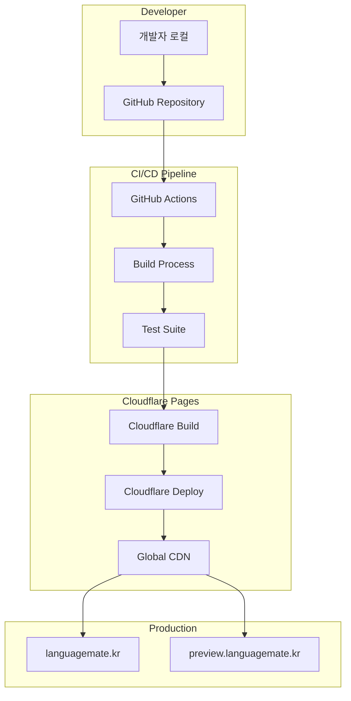

# 인프라 및 모니터링 가이드

**최종 업데이트**: 2025-01-13

## 📋 개요

STUDYMATE-CLIENT의 배포 인프라, CI/CD 파이프라인, 모니터링 시스템, 그리고 운영 관찰성(Observability)을 통합적으로 설명합니다.

## 🏗️ 인프라 아키텍처

### 전체 배포 구조


### 모니터링 계층
```
STUDYMATE Monitoring Stack
├── Infrastructure Level
│   ├── Cloudflare Edge Analytics
│   ├── DNS Resolution Metrics
│   ├── CDN Cache Hit Rates
│   └── SSL/TLS Performance
├── Application Level
│   ├── Frontend Performance (Web Vitals)
│   ├── API Response Times
│   ├── WebRTC Connection Quality
│   └── User Experience Metrics
├── Business Level
│   ├── User Engagement Metrics
│   ├── Session Success Rates
│   ├── Matching Effectiveness
│   └── Learning Progress Tracking
└── Security Level
    ├── Authentication Failures
    ├── Suspicious Activity Detection
    ├── Rate Limit Violations
    └── Data Access Patterns
```

### 기술 스택
- **프론트엔드 배포**: Cloudflare Pages
- **백엔드 배포**: Cloudflare Workers
- **모니터링**: Cloudflare Analytics + Web Vitals
- **에러 트래킹**: Sentry
- **실시간 모니터링**: Cloudflare Dashboard
- **커스텀 메트릭**: Cloudflare Workers KV

## 🌐 Cloudflare Pages 설정

### 프로젝트 설정
```yaml
# Cloudflare Pages 설정
Project Name: studymate-client
Build Command: npm run build
Build Output Directory: dist
Root Directory: /
Node.js Version: 18.x

# Environment Variables (Production)
VITE_API_URL: https://api.languagemate.kr
VITE_WS_URL: wss://api.languagemate.kr/ws
VITE_ENV: production

# Environment Variables (Preview)
VITE_API_URL: https://api-staging.languagemate.kr
VITE_WS_URL: wss://api-staging.languagemate.kr/ws
VITE_ENV: staging
```

### 도메인 설정
```bash
# Custom Domains
Production: languagemate.kr
Preview: preview.languagemate.kr

# SSL/TLS
Mode: Full (strict)
Always Use HTTPS: Enabled
Minimum TLS Version: 1.2
```

### Build 설정
```yaml
# Build Configuration
Build System: v2
Build Image: default

# Build Commands
Install Command: npm ci
Build Command: npm run build
Output Directory: dist

# Node.js Settings
Node.js Version: 18.17.1
Package Manager: npm
```

## 🔄 CI/CD 파이프라인

### GitHub Actions Workflow
```yaml
# .github/workflows/deploy.yml
name: Deploy to Cloudflare Pages

on:
  push:
    branches: [main, develop]
  pull_request:
    branches: [main]

jobs:
  build-and-deploy:
    runs-on: ubuntu-latest

    steps:
      - name: Checkout
        uses: actions/checkout@v4

      - name: Setup Node.js
        uses: actions/setup-node@v4
        with:
          node-version: '18'
          cache: 'npm'

      - name: Install dependencies
        run: npm ci

      - name: Run tests
        run: npm run test

      - name: Run linting
        run: npm run lint

      - name: Build project
        run: npm run build
        env:
          VITE_API_URL: ${{ secrets.VITE_API_URL }}
          VITE_WS_URL: ${{ secrets.VITE_WS_URL }}

      - name: Deploy to Cloudflare Pages
        uses: cloudflare/pages-action@v1
        with:
          apiToken: ${{ secrets.CLOUDFLARE_API_TOKEN }}
          accountId: ${{ secrets.CLOUDFLARE_ACCOUNT_ID }}
          projectName: studymate-client
          directory: dist
          branch: ${{ github.ref_name }}
```

### 브랜치별 배포 전략
```yaml
# Branch Deployment Strategy
main:
  target: Production (languagemate.kr)
  environment: production
  auto_deploy: true

develop:
  target: Preview (preview.languagemate.kr)
  environment: staging
  auto_deploy: true

feature/*:
  target: Preview URL
  environment: preview
  auto_deploy: on_pull_request
```

## 📦 빌드 프로세스

### 로컬 빌드
```bash
# 개발 환경 실행
npm run dev

# 프로덕션 빌드
npm run build

# 빌드 미리보기
npm run preview

# 타입 체크
npm run typecheck

# 린팅
npm run lint

# 테스트 실행
npm run test
```

### 빌드 최적화
```javascript
// vite.config.js
import { defineConfig } from 'vite';
import react from '@vitejs/plugin-react';

export default defineConfig({
  plugins: [react()],
  build: {
    outDir: 'dist',
    sourcemap: false,
    minify: 'terser',
    target: 'es2015',
    cssCodeSplit: true,
    rollupOptions: {
      output: {
        manualChunks: {
          vendor: ['react', 'react-dom'],
          ui: ['@headlessui/react', 'lucide-react'],
          utils: ['axios', 'zustand', 'jwt-decode']
        }
      }
    }
  },
  define: {
    'process.env': process.env
  }
});
```

## 🔐 환경 변수 관리

### 환경별 변수 설정
```bash
# .env.local (개발환경)
VITE_API_URL=http://localhost:8080
VITE_WS_URL=ws://localhost:8080/ws
VITE_ENV=development

# .env.staging (스테이징)
VITE_API_URL=https://api-staging.languagemate.kr
VITE_WS_URL=wss://api-staging.languagemate.kr/ws
VITE_ENV=staging

# .env.production (프로덕션)
VITE_API_URL=https://api.languagemate.kr
VITE_WS_URL=wss://api.languagemate.kr/ws
VITE_ENV=production
```

### GitHub Secrets 설정
```bash
# GitHub Repository Secrets
CLOUDFLARE_API_TOKEN=your_cloudflare_api_token
CLOUDFLARE_ACCOUNT_ID=your_cloudflare_account_id
VITE_API_URL=https://api.languagemate.kr
VITE_WS_URL=wss://api.languagemate.kr/ws

# 민감하지 않은 변수는 환경별 설정 파일 사용
```

## 🚀 배포 명령어

### Wrangler CLI를 사용한 수동 배포
```bash
# Wrangler 설치 및 로그인
npm install -g wrangler
wrangler login

# 프로덕션 배포
npm run build
wrangler pages deploy dist --project-name=studymate-client --branch=main

# 프리뷰 배포
npm run build
wrangler pages deploy dist --project-name=studymate-client --branch=preview

# 배포 상태 확인
wrangler pages deployment list --project-name=studymate-client
```

### 배포 스크립트
```json
{
  "scripts": {
    "deploy:prod": "npm run build && wrangler pages deploy dist --project-name=studymate-client --branch=main",
    "deploy:staging": "npm run build && wrangler pages deploy dist --project-name=studymate-client --branch=develop",
    "deploy:preview": "npm run build && wrangler pages deploy dist --project-name=studymate-client"
  }
}
```

## 🔍 배포 후 검증

### 자동 검증 스크립트
```bash
#!/bin/bash
# deploy-check.sh

echo "🚀 Starting deployment verification..."

# Health check
echo "📡 Checking site availability..."
curl -f https://languagemate.kr || exit 1

# Performance check
echo "⚡ Running Lighthouse audit..."
lighthouse https://languagemate.kr --chrome-flags="--headless" --output=json --quiet

# API connectivity check
echo "🔌 Testing API connectivity..."
curl -f https://api.languagemate.kr/health || exit 1

echo "✅ Deployment verification completed successfully!"
```

### 수동 검증 체크리스트
- [ ] 사이트 접속 가능 (https://languagemate.kr)
- [ ] 네이버 OAuth 로그인 작동
- [ ] API 통신 정상 작동
- [ ] WebSocket 연결 성공
- [ ] 반응형 디자인 확인 (모바일/태블릿/데스크톱)
- [ ] 주요 기능 테스트 (로그인, 온보딩, 채팅)
- [ ] 성능 메트릭 확인 (Core Web Vitals)
- [ ] 에러 로그 확인

## 📊 프론트엔드 모니터링

### Web Vitals 추적
```typescript
// src/utils/webVitals.ts
import { getCLS, getFID, getFCP, getLCP, getTTFB } from 'web-vitals';

interface VitalMetric {
  name: string;
  value: number;
  rating: 'good' | 'needs-improvement' | 'poor';
  delta: number;
  entries: any[];
  id: string;
  navigationType: string;
}

class WebVitalsTracker {
  private metrics: Map<string, VitalMetric> = new Map();
  private sendBeacon: boolean = navigator.sendBeacon !== undefined;

  constructor() {
    this.initializeTracking();
  }

  private initializeTracking() {
    // Core Web Vitals 추적
    getCLS(this.handleMetric.bind(this, 'CLS'));
    getFID(this.handleMetric.bind(this, 'FID'));
    getFCP(this.handleMetric.bind(this, 'FCP'));
    getLCP(this.handleMetric.bind(this, 'LCP'));
    getTTFB(this.handleMetric.bind(this, 'TTFB'));

    // 페이지 언로드 시 메트릭 전송
    window.addEventListener('beforeunload', this.sendMetrics.bind(this));
  }

  private handleMetric(name: string, metric: VitalMetric) {
    this.metrics.set(name, metric);

    // 실시간으로 중요한 메트릭 전송
    if (name === 'LCP' || name === 'FID') {
      this.sendSingleMetric(name, metric);
    }
  }

  private sendSingleMetric(name: string, metric: VitalMetric) {
    const data = {
      name,
      value: metric.value,
      rating: metric.rating,
      page: window.location.pathname,
      timestamp: Date.now(),
      userId: this.getUserId(),
      sessionId: this.getSessionId()
    };

    // Cloudflare Analytics로 전송
    if (this.sendBeacon) {
      navigator.sendBeacon('/api/analytics/web-vitals', JSON.stringify(data));
    } else {
      fetch('/api/analytics/web-vitals', {
        method: 'POST',
        body: JSON.stringify(data),
        headers: { 'Content-Type': 'application/json' },
        keepalive: true
      }).catch(console.warn);
    }
  }

  private sendMetrics() {
    const metricsData = Array.from(this.metrics.entries()).map(([name, metric]) => ({
      name,
      value: metric.value,
      rating: metric.rating,
      page: window.location.pathname,
      timestamp: Date.now(),
      userId: this.getUserId(),
      sessionId: this.getSessionId()
    }));

    if (metricsData.length > 0) {
      navigator.sendBeacon('/api/analytics/web-vitals-batch', JSON.stringify(metricsData));
    }
  }

  private getUserId(): string | null {
    const authState = localStorage.getItem('auth-storage');
    if (authState) {
      try {
        const parsed = JSON.parse(authState);
        return parsed.state?.user?.id || null;
      } catch {
        return null;
      }
    }
    return null;
  }

  private getSessionId(): string {
    let sessionId = sessionStorage.getItem('session-id');
    if (!sessionId) {
      sessionId = `session_${Date.now()}_${Math.random().toString(36).substr(2, 9)}`;
      sessionStorage.setItem('session-id', sessionId);
    }
    return sessionId;
  }
}

export const webVitalsTracker = new WebVitalsTracker();
```

### 사용자 행동 추적
```typescript
// src/utils/userAnalytics.ts
interface UserEvent {
  action: string;
  category: string;
  label?: string;
  value?: number;
  customDimensions?: Record<string, any>;
}

class UserAnalytics {
  private eventQueue: UserEvent[] = [];
  private flushTimer: number | null = null;
  private readonly BATCH_SIZE = 10;
  private readonly FLUSH_INTERVAL = 5000; // 5초

  track(event: UserEvent) {
    this.eventQueue.push({
      ...event,
      timestamp: Date.now(),
      userId: this.getUserId(),
      sessionId: this.getSessionId(),
      page: window.location.pathname
    });

    if (this.eventQueue.length >= this.BATCH_SIZE) {
      this.flush();
    } else {
      this.scheduleFlush();
    }
  }

  // 주요 이벤트들
  trackPageView(page: string) {
    this.track({
      action: 'page_view',
      category: 'navigation',
      label: page
    });
  }

  trackSessionStart(sessionType: 'audio' | 'video', partnerId: string) {
    this.track({
      action: 'session_start',
      category: 'learning',
      label: sessionType,
      customDimensions: { partnerId }
    });
  }

  trackMatchingRequest(partnerId: string, compatibility: number) {
    this.track({
      action: 'matching_request',
      category: 'matching',
      value: compatibility,
      customDimensions: { partnerId }
    });
  }

  trackLevelTestComplete(language: string, level: string, score: number) {
    this.track({
      action: 'level_test_complete',
      category: 'assessment',
      label: `${language}_${level}`,
      value: score
    });
  }

  trackError(error: string, context: string) {
    this.track({
      action: 'error',
      category: 'technical',
      label: error,
      customDimensions: { context }
    });
  }

  private scheduleFlush() {
    if (this.flushTimer) return;

    this.flushTimer = window.setTimeout(() => {
      this.flush();
    }, this.FLUSH_INTERVAL);
  }

  private flush() {
    if (this.eventQueue.length === 0) return;

    const events = [...this.eventQueue];
    this.eventQueue = [];

    if (this.flushTimer) {
      clearTimeout(this.flushTimer);
      this.flushTimer = null;
    }

    fetch('/api/analytics/events', {
      method: 'POST',
      headers: { 'Content-Type': 'application/json' },
      body: JSON.stringify({ events }),
      keepalive: true
    }).catch(console.warn);
  }

  private getUserId(): string | null {
    const authState = localStorage.getItem('auth-storage');
    if (authState) {
      try {
        const parsed = JSON.parse(authState);
        return parsed.state?.user?.id || null;
      } catch {
        return null;
      }
    }
    return null;
  }

  private getSessionId(): string {
    let sessionId = sessionStorage.getItem('session-id');
    if (!sessionId) {
      sessionId = `session_${Date.now()}_${Math.random().toString(36).substr(2, 9)}`;
      sessionStorage.setItem('session-id', sessionId);
    }
    return sessionId;
  }
}

export const userAnalytics = new UserAnalytics();

// React Hook으로 쉽게 사용
export function useAnalytics() {
  const trackPageView = (page: string) => userAnalytics.trackPageView(page);
  const trackSessionStart = (type: 'audio' | 'video', partnerId: string) =>
    userAnalytics.trackSessionStart(type, partnerId);
  const trackMatchingRequest = (partnerId: string, compatibility: number) =>
    userAnalytics.trackMatchingRequest(partnerId, compatibility);
  const trackLevelTestComplete = (language: string, level: string, score: number) =>
    userAnalytics.trackLevelTestComplete(language, level, score);
  const trackError = (error: string, context: string) =>
    userAnalytics.trackError(error, context);

  return {
    trackPageView,
    trackSessionStart,
    trackMatchingRequest,
    trackLevelTestComplete,
    trackError
  };
}
```

### 실시간 성능 모니터링
```typescript
// src/utils/performanceMonitor.ts
class PerformanceMonitor {
  private observer: PerformanceObserver | null = null;
  private networkObserver: PerformanceObserver | null = null;

  constructor() {
    this.initializeObservers();
  }

  private initializeObservers() {
    // Long Task 감지
    if ('PerformanceObserver' in window) {
      this.observer = new PerformanceObserver((list) => {
        list.getEntries().forEach(entry => {
          if (entry.entryType === 'longtask') {
            this.reportLongTask(entry);
          } else if (entry.entryType === 'navigation') {
            this.reportNavigationTiming(entry as PerformanceNavigationTiming);
          }
        });
      });

      try {
        this.observer.observe({ entryTypes: ['longtask', 'navigation'] });
      } catch (e) {
        console.warn('PerformanceObserver not supported');
      }

      // 네트워크 요청 모니터링
      this.networkObserver = new PerformanceObserver((list) => {
        list.getEntries().forEach(entry => {
          if (entry.entryType === 'resource') {
            this.analyzeResourceTiming(entry as PerformanceResourceTiming);
          }
        });
      });

      try {
        this.networkObserver.observe({ entryTypes: ['resource'] });
      } catch (e) {
        console.warn('Resource timing observer not supported');
      }
    }
  }

  private reportLongTask(entry: PerformanceEntry) {
    const data = {
      type: 'long_task',
      duration: entry.duration,
      startTime: entry.startTime,
      page: window.location.pathname,
      timestamp: Date.now()
    };

    // 5초 이상의 긴 작업은 즉시 보고
    if (entry.duration > 5000) {
      this.sendAlert('critical_performance_issue', data);
    } else {
      this.logPerformanceData(data);
    }
  }

  private reportNavigationTiming(entry: PerformanceNavigationTiming) {
    const data = {
      type: 'navigation',
      domContentLoaded: entry.domContentLoadedEventEnd - entry.domContentLoadedEventStart,
      loadComplete: entry.loadEventEnd - entry.loadEventStart,
      firstPaint: this.getFirstPaint(),
      firstContentfulPaint: this.getFirstContentfulPaint(),
      page: window.location.pathname,
      timestamp: Date.now()
    };

    this.logPerformanceData(data);
  }

  private analyzeResourceTiming(entry: PerformanceResourceTiming) {
    // 느린 API 요청 감지
    if (entry.name.includes('/api/') && entry.duration > 3000) {
      this.reportSlowAPI(entry);
    }

    // 큰 리소스 감지
    if (entry.transferSize && entry.transferSize > 1024 * 1024) { // 1MB 초과
      this.reportLargeResource(entry);
    }
  }

  private reportSlowAPI(entry: PerformanceResourceTiming) {
    const data = {
      type: 'slow_api',
      url: entry.name,
      duration: entry.duration,
      responseStart: entry.responseStart,
      responseEnd: entry.responseEnd,
      transferSize: entry.transferSize,
      timestamp: Date.now()
    };

    this.sendAlert('slow_api_response', data);
  }

  private reportLargeResource(entry: PerformanceResourceTiming) {
    const data = {
      type: 'large_resource',
      url: entry.name,
      transferSize: entry.transferSize,
      duration: entry.duration,
      timestamp: Date.now()
    };

    this.logPerformanceData(data);
  }

  private getFirstPaint(): number | null {
    const paintEntries = performance.getEntriesByType('paint');
    const firstPaint = paintEntries.find(entry => entry.name === 'first-paint');
    return firstPaint ? firstPaint.startTime : null;
  }

  private getFirstContentfulPaint(): number | null {
    const paintEntries = performance.getEntriesByType('paint');
    const firstContentfulPaint = paintEntries.find(entry => entry.name === 'first-contentful-paint');
    return firstContentfulPaint ? firstContentfulPaint.startTime : null;
  }

  private logPerformanceData(data: any) {
    fetch('/api/analytics/performance', {
      method: 'POST',
      headers: { 'Content-Type': 'application/json' },
      body: JSON.stringify(data),
      keepalive: true
    }).catch(console.warn);
  }

  private sendAlert(alertType: string, data: any) {
    fetch('/api/alerts/performance', {
      method: 'POST',
      headers: { 'Content-Type': 'application/json' },
      body: JSON.stringify({
        alertType,
        severity: 'high',
        data,
        userAgent: navigator.userAgent,
        url: window.location.href
      }),
      keepalive: true
    }).catch(console.warn);
  }

  // 메모리 사용량 모니터링
  getMemoryInfo() {
    if ('memory' in performance) {
      const memory = (performance as any).memory;
      return {
        usedJSHeapSize: memory.usedJSHeapSize,
        totalJSHeapSize: memory.totalJSHeapSize,
        jsHeapSizeLimit: memory.jsHeapSizeLimit,
        timestamp: Date.now()
      };
    }
    return null;
  }

  // 주기적 메모리 체크
  startMemoryMonitoring() {
    setInterval(() => {
      const memoryInfo = this.getMemoryInfo();
      if (memoryInfo) {
        // 메모리 사용량이 80% 이상이면 경고
        const usagePercent = memoryInfo.usedJSHeapSize / memoryInfo.jsHeapSizeLimit;
        if (usagePercent > 0.8) {
          this.sendAlert('high_memory_usage', memoryInfo);
        }

        this.logPerformanceData({
          type: 'memory_usage',
          ...memoryInfo
        });
      }
    }, 30000); // 30초마다 체크
  }
}

export const performanceMonitor = new PerformanceMonitor();
```

## 🔧 Cloudflare Workers 모니터링

### Workers Analytics 구현
```typescript
// workers/src/analytics.ts
import { KVNamespace } from '@cloudflare/workers-types';

interface WorkerMetrics {
  requestCount: number;
  errorCount: number;
  averageResponseTime: number;
  webrtcConnections: number;
  levelTestsCompleted: number;
}

class WorkersAnalytics {
  constructor(private kv: KVNamespace) {}

  async recordRequest(request: Request, response: Response, duration: number) {
    const key = this.getMetricKey('requests', new Date());
    const metrics = await this.getMetrics(key);

    metrics.requestCount++;
    if (response.status >= 400) {
      metrics.errorCount++;
    }

    // 이동 평균 계산
    metrics.averageResponseTime =
      (metrics.averageResponseTime * (metrics.requestCount - 1) + duration) /
      metrics.requestCount;

    await this.storeMetrics(key, metrics);
  }

  async recordWebRTCConnection(type: 'audio' | 'video', success: boolean) {
    const key = this.getMetricKey('webrtc', new Date());
    const metrics = await this.getMetrics(key);

    if (success) {
      metrics.webrtcConnections++;
    } else {
      metrics.errorCount++;
    }

    await this.storeMetrics(key, metrics);
  }

  async recordLevelTestCompletion(language: string, level: string, score: number) {
    const key = this.getMetricKey('level_tests', new Date());
    const metrics = await this.getMetrics(key);

    metrics.levelTestsCompleted++;

    // 언어별, 레벨별 통계 별도 저장
    const langKey = this.getMetricKey(`level_tests_${language}`, new Date());
    const langMetrics = await this.getMetrics(langKey);
    langMetrics.levelTestsCompleted++;

    await Promise.all([
      this.storeMetrics(key, metrics),
      this.storeMetrics(langKey, langMetrics),
      this.recordScore(language, level, score)
    ]);
  }

  private async recordScore(language: string, level: string, score: number) {
    const scoresKey = `scores_${language}_${level}_${this.getDateString(new Date())}`;
    const existingScores = await this.kv.get(scoresKey, 'json') as number[] || [];
    existingScores.push(score);

    await this.kv.put(scoresKey, JSON.stringify(existingScores), {
      expirationTtl: 86400 * 30 // 30일 보관
    });
  }

  private async getMetrics(key: string): Promise<WorkerMetrics> {
    const existing = await this.kv.get(key, 'json') as WorkerMetrics;
    return existing || {
      requestCount: 0,
      errorCount: 0,
      averageResponseTime: 0,
      webrtcConnections: 0,
      levelTestsCompleted: 0
    };
  }

  private async storeMetrics(key: string, metrics: WorkerMetrics) {
    await this.kv.put(key, JSON.stringify(metrics), {
      expirationTtl: 86400 * 7 // 7일 보관
    });
  }

  private getMetricKey(type: string, date: Date): string {
    return `metrics_${type}_${this.getDateString(date)}_${this.getHour(date)}`;
  }

  private getDateString(date: Date): string {
    return date.toISOString().split('T')[0];
  }

  private getHour(date: Date): string {
    return date.getHours().toString().padStart(2, '0');
  }

  // 메트릭 조회 API
  async getHourlyMetrics(type: string, date: string): Promise<WorkerMetrics[]> {
    const metrics: WorkerMetrics[] = [];

    for (let hour = 0; hour < 24; hour++) {
      const key = `metrics_${type}_${date}_${hour.toString().padStart(2, '0')}`;
      const hourMetrics = await this.getMetrics(key);
      metrics.push(hourMetrics);
    }

    return metrics;
  }

  async getDailyMetrics(type: string, days: number = 7): Promise<Record<string, WorkerMetrics>> {
    const dailyMetrics: Record<string, WorkerMetrics> = {};
    const today = new Date();

    for (let i = 0; i < days; i++) {
      const date = new Date(today);
      date.setDate(date.getDate() - i);
      const dateString = this.getDateString(date);

      const hourlyData = await this.getHourlyMetrics(type, dateString);
      dailyMetrics[dateString] = hourlyData.reduce((acc, curr) => ({
        requestCount: acc.requestCount + curr.requestCount,
        errorCount: acc.errorCount + curr.errorCount,
        averageResponseTime: (acc.averageResponseTime + curr.averageResponseTime) / 2,
        webrtcConnections: acc.webrtcConnections + curr.webrtcConnections,
        levelTestsCompleted: acc.levelTestsCompleted + curr.levelTestsCompleted
      }));
    }

    return dailyMetrics;
  }
}

// Workers 환경에서 사용
export async function handleAnalyticsRequest(
  request: Request,
  env: { ANALYTICS_KV: KVNamespace }
): Promise<Response> {
  const analytics = new WorkersAnalytics(env.ANALYTICS_KV);
  const url = new URL(request.url);

  if (url.pathname === '/analytics/metrics') {
    const type = url.searchParams.get('type') || 'requests';
    const days = parseInt(url.searchParams.get('days') || '7');

    const metrics = await analytics.getDailyMetrics(type, days);
    return new Response(JSON.stringify(metrics), {
      headers: { 'Content-Type': 'application/json' }
    });
  }

  return new Response('Not found', { status: 404 });
}
```

## 🚨 에러 추적 및 알림

### Sentry 통합
```typescript
// src/utils/errorTracking.ts
import * as Sentry from '@sentry/react';
import { BrowserTracing } from '@sentry/tracing';

// Sentry 초기화
Sentry.init({
  dsn: import.meta.env.VITE_SENTRY_DSN,
  environment: import.meta.env.MODE,
  integrations: [
    new BrowserTracing({
      routingInstrumentation: Sentry.reactRouterV6Instrumentation(
        React.useEffect,
        useLocation,
        useNavigationType,
        createRoutesFromChildren,
        matchRoutes
      ),
    }),
  ],
  tracesSampleRate: 0.1, // 10% 샘플링
  beforeSend: (event, hint) => {
    if (import.meta.env.DEV) {
      console.error('Sentry Error:', event, hint);
    }
    return event;
  },
  beforeBreadcrumb: (breadcrumb) => {
    // 민감한 정보 필터링
    if (breadcrumb.category === 'console' && breadcrumb.message) {
      if (breadcrumb.message.includes('token') || breadcrumb.message.includes('password')) {
        return null;
      }
    }
    return breadcrumb;
  }
});

// 커스텀 에러 리포터
class ErrorReporter {
  reportError(error: Error, context?: Record<string, any>) {
    Sentry.withScope((scope) => {
      if (context) {
        Object.entries(context).forEach(([key, value]) => {
          scope.setExtra(key, value);
        });
      }

      scope.setLevel('error');
      Sentry.captureException(error);
    });
  }

  reportWarning(message: string, context?: Record<string, any>) {
    Sentry.withScope((scope) => {
      if (context) {
        Object.entries(context).forEach(([key, value]) => {
          scope.setExtra(key, value);
        });
      }

      scope.setLevel('warning');
      Sentry.captureMessage(message);
    });
  }

  setUser(user: { id: string; email?: string; username?: string }) {
    Sentry.setUser(user);
  }

  addBreadcrumb(message: string, category: string, data?: any) {
    Sentry.addBreadcrumb({
      message,
      category,
      data,
      level: 'info'
    });
  }
}

export const errorReporter = new ErrorReporter();

// React Error Boundary
export const SentryErrorBoundary = Sentry.withErrorBoundary(
  ({ children }: { children: React.ReactNode }) => children,
  {
    fallback: ({ error, resetError }) => (
      <div className="error-boundary">
        <h2>문제가 발생했습니다</h2>
        <p>페이지를 새로고침하거나 잠시 후 다시 시도해 주세요.</p>
        <button onClick={resetError}>다시 시도</button>
        <details>
          <summary>에러 상세 정보</summary>
          <pre>{error.message}</pre>
        </details>
      </div>
    ),
    beforeCapture: (scope) => {
      scope.setTag('errorBoundary', true);
    }
  }
);
```

### 실시간 알림 시스템
```typescript
// workers/src/alerting.ts
interface AlertRule {
  name: string;
  condition: (metrics: any) => boolean;
  severity: 'low' | 'medium' | 'high' | 'critical';
  cooldownMinutes: number;
}

class AlertingSystem {
  private alertRules: AlertRule[] = [
    {
      name: 'high_error_rate',
      condition: (metrics) => metrics.errorRate > 0.05, // 5% 이상
      severity: 'high',
      cooldownMinutes: 15
    },
    {
      name: 'slow_response_time',
      condition: (metrics) => metrics.averageResponseTime > 5000, // 5초 이상
      severity: 'medium',
      cooldownMinutes: 10
    },
    {
      name: 'webrtc_failure_rate',
      condition: (metrics) => metrics.webrtcFailureRate > 0.1, // 10% 이상
      severity: 'high',
      cooldownMinutes: 5
    },
    {
      name: 'memory_usage_critical',
      condition: (metrics) => metrics.memoryUsage > 0.9, // 90% 이상
      severity: 'critical',
      cooldownMinutes: 5
    }
  ];

  constructor(private kv: KVNamespace) {}

  async checkAlerts(metrics: any) {
    const activeAlerts = [];

    for (const rule of this.alertRules) {
      if (await this.shouldTriggerAlert(rule, metrics)) {
        const alert = await this.createAlert(rule, metrics);
        activeAlerts.push(alert);
        await this.sendAlert(alert);
        await this.recordAlertTrigger(rule.name);
      }
    }

    return activeAlerts;
  }

  private async shouldTriggerAlert(rule: AlertRule, metrics: any): Promise<boolean> {
    if (!rule.condition(metrics)) {
      return false;
    }

    // 쿨다운 확인
    const lastTriggered = await this.getLastAlertTime(rule.name);
    if (lastTriggered) {
      const cooldownMs = rule.cooldownMinutes * 60 * 1000;
      if (Date.now() - lastTriggered < cooldownMs) {
        return false;
      }
    }

    return true;
  }

  private async createAlert(rule: AlertRule, metrics: any) {
    return {
      id: `alert_${Date.now()}_${Math.random().toString(36).substr(2, 9)}`,
      name: rule.name,
      severity: rule.severity,
      message: this.generateAlertMessage(rule, metrics),
      metrics,
      timestamp: Date.now()
    };
  }

  private generateAlertMessage(rule: AlertRule, metrics: any): string {
    switch (rule.name) {
      case 'high_error_rate':
        return `Error rate is ${(metrics.errorRate * 100).toFixed(1)}% (threshold: 5%)`;
      case 'slow_response_time':
        return `Average response time is ${metrics.averageResponseTime}ms (threshold: 5000ms)`;
      case 'webrtc_failure_rate':
        return `WebRTC failure rate is ${(metrics.webrtcFailureRate * 100).toFixed(1)}% (threshold: 10%)`;
      case 'memory_usage_critical':
        return `Memory usage is ${(metrics.memoryUsage * 100).toFixed(1)}% (threshold: 90%)`;
      default:
        return `Alert triggered: ${rule.name}`;
    }
  }

  private async sendAlert(alert: any) {
    // Slack webhook으로 알림 전송
    const slackPayload = {
      text: `🚨 STUDYMATE Alert: ${alert.name}`,
      attachments: [{
        color: this.getSeverityColor(alert.severity),
        fields: [
          { title: 'Severity', value: alert.severity, short: true },
          { title: 'Message', value: alert.message, short: false },
          { title: 'Timestamp', value: new Date(alert.timestamp).toISOString(), short: true }
        ]
      }]
    };

    await fetch(process.env.SLACK_WEBHOOK_URL, {
      method: 'POST',
      headers: { 'Content-Type': 'application/json' },
      body: JSON.stringify(slackPayload)
    });

    // 이메일 알림 (critical 등급만)
    if (alert.severity === 'critical') {
      await this.sendEmailAlert(alert);
    }
  }

  private getSeverityColor(severity: string): string {
    const colors = {
      low: '#36a64f',
      medium: '#ff9500',
      high: '#ff0000',
      critical: '#800080'
    };
    return colors[severity] || '#cccccc';
  }

  private async sendEmailAlert(alert: any) {
    // SendGrid나 다른 이메일 서비스를 통한 이메일 발송
    const emailPayload = {
      to: process.env.ALERT_EMAIL_RECIPIENTS.split(','),
      subject: `🚨 STUDYMATE Critical Alert: ${alert.name}`,
      html: `
        <h2>Critical Alert Triggered</h2>
        <p><strong>Alert:</strong> ${alert.name}</p>
        <p><strong>Message:</strong> ${alert.message}</p>
        <p><strong>Severity:</strong> ${alert.severity}</p>
        <p><strong>Time:</strong> ${new Date(alert.timestamp).toISOString()}</p>
      `
    };
  }

  private async getLastAlertTime(alertName: string): Promise<number | null> {
    const key = `alert_last_${alertName}`;
    const lastTime = await this.kv.get(key);
    return lastTime ? parseInt(lastTime) : null;
  }

  private async recordAlertTrigger(alertName: string) {
    const key = `alert_last_${alertName}`;
    await this.kv.put(key, Date.now().toString(), {
      expirationTtl: 86400 // 24시간 후 만료
    });
  }
}

export { AlertingSystem };
```

## 📈 대시보드 및 시각화

### 실시간 모니터링 대시보드
```typescript
// src/components/admin/MonitoringDashboard.tsx
import { useEffect, useState } from 'react';
import { Line, Doughnut, Bar } from 'react-chartjs-2';

interface DashboardMetrics {
  webVitals: {
    lcp: number[];
    fid: number[];
    cls: number[];
  };
  userEngagement: {
    activeUsers: number;
    sessionsToday: number;
    averageSessionTime: number;
  };
  systemHealth: {
    errorRate: number;
    averageResponseTime: number;
    uptime: number;
  };
  businessMetrics: {
    matchingSuccessRate: number;
    levelTestsCompleted: number;
    userSatisfaction: number;
  };
}

export function MonitoringDashboard() {
  const [metrics, setMetrics] = useState<DashboardMetrics | null>(null);
  const [timeRange, setTimeRange] = useState<'1h' | '24h' | '7d'>('24h');

  useEffect(() => {
    const fetchMetrics = async () => {
      try {
        const response = await fetch(`/api/admin/metrics?range=${timeRange}`);
        const data = await response.json();
        setMetrics(data);
      } catch (error) {
        console.error('Failed to fetch metrics:', error);
      }
    };

    fetchMetrics();
    const interval = setInterval(fetchMetrics, 30000); // 30초마다 업데이트

    return () => clearInterval(interval);
  }, [timeRange]);

  if (!metrics) {
    return <div className="loading">Loading dashboard...</div>;
  }

  return (
    <div className="monitoring-dashboard">
      <div className="dashboard-header">
        <h1>STUDYMATE 모니터링 대시보드</h1>
        <div className="time-range-selector">
          {['1h', '24h', '7d'].map(range => (
            <button
              key={range}
              className={timeRange === range ? 'active' : ''}
              onClick={() => setTimeRange(range as any)}
            >
              {range}
            </button>
          ))}
        </div>
      </div>

      {/* Core Web Vitals */}
      <div className="metrics-grid">
        <div className="metric-card">
          <h3>Core Web Vitals</h3>
          <div className="web-vitals">
            <div className="vital">
              <span className="label">LCP</span>
              <span className="value">{formatMs(average(metrics.webVitals.lcp))}</span>
            </div>
            <div className="vital">
              <span className="label">FID</span>
              <span className="value">{formatMs(average(metrics.webVitals.fid))}</span>
            </div>
            <div className="vital">
              <span className="label">CLS</span>
              <span className="value">{average(metrics.webVitals.cls).toFixed(3)}</span>
            </div>
          </div>
        </div>

        {/* 사용자 참여도 */}
        <div className="metric-card">
          <h3>사용자 참여도</h3>
          <div className="engagement-metrics">
            <div className="metric">
              <span className="number">{metrics.userEngagement.activeUsers}</span>
              <span className="label">활성 사용자</span>
            </div>
            <div className="metric">
              <span className="number">{metrics.userEngagement.sessionsToday}</span>
              <span className="label">오늘 세션</span>
            </div>
            <div className="metric">
              <span className="number">{formatTime(metrics.userEngagement.averageSessionTime)}</span>
              <span className="label">평균 세션 시간</span>
            </div>
          </div>
        </div>

        {/* 시스템 상태 */}
        <div className="metric-card">
          <h3>시스템 상태</h3>
          <div className="system-health">
            <div className="health-metric">
              <Doughnut
                data={{
                  datasets: [{
                    data: [
                      100 - metrics.systemHealth.errorRate * 100,
                      metrics.systemHealth.errorRate * 100
                    ],
                    backgroundColor: ['#4CAF50', '#F44336']
                  }]
                }}
              />
              <div className="health-label">
                <span>에러율</span>
                <span>{(metrics.systemHealth.errorRate * 100).toFixed(2)}%</span>
              </div>
            </div>

            <div className="response-time">
              <span className="label">평균 응답 시간</span>
              <span className="value">{formatMs(metrics.systemHealth.averageResponseTime)}</span>
            </div>

            <div className="uptime">
              <span className="label">가동시간</span>
              <span className="value">{(metrics.systemHealth.uptime * 100).toFixed(2)}%</span>
            </div>
          </div>
        </div>
      </div>
    </div>
  );
}

// 헬퍼 함수
function average(arr: number[]): number {
  return arr.reduce((sum, val) => sum + val, 0) / arr.length;
}

function formatMs(ms: number): string {
  return `${ms.toFixed(0)}ms`;
}

function formatTime(seconds: number): string {
  const minutes = Math.floor(seconds / 60);
  const remainingSeconds = seconds % 60;
  return `${minutes}:${remainingSeconds.toFixed(0).padStart(2, '0')}`;
}
```

## 🔧 성능 최적화

### 캐싱 전략
```javascript
// sw.js - Service Worker 캐싱
const CACHE_NAME = 'studymate-v1';
const urlsToCache = [
  '/',
  '/static/css/main.css',
  '/static/js/main.js',
  '/fonts/Pretendard.woff2'
];

self.addEventListener('install', (event) => {
  event.waitUntil(
    caches.open(CACHE_NAME)
      .then((cache) => cache.addAll(urlsToCache))
  );
});
```

### 이미지 최적화
```javascript
// src/components/common/OptimizedImage.tsx
interface OptimizedImageProps {
  src: string;
  alt: string;
  width?: number;
  height?: number;
  loading?: 'lazy' | 'eager';
}

const OptimizedImage: React.FC<OptimizedImageProps> = ({
  src,
  alt,
  width,
  height,
  loading = 'lazy'
}) => {
  const [loaded, setLoaded] = useState(false);

  return (
    <div className="relative overflow-hidden">
      {!loaded && <div className="skeleton" style={{ width, height }} />}
       setLoaded(true)}
        className={`transition-opacity duration-300 ${loaded ? 'opacity-100' : 'opacity-0'}`}
      />
    </div>
  );
};
```

## 🚨 트러블슈팅

### 일반적인 배포 문제

#### 1. 빌드 실패
```bash
# 문제: 의존성 설치 실패
# 해결: package-lock.json 확인 및 재설치
rm -rf node_modules package-lock.json
npm install

# 문제: 메모리 부족
# 해결: Node.js 메모리 증가
export NODE_OPTIONS="--max_old_space_size=4096"
npm run build
```

#### 2. 환경 변수 문제
```bash
# 문제: 환경 변수가 빌드에 포함되지 않음
# 해결: VITE_ 접두사 확인
# ❌ API_URL=https://api.example.com
# ✅ VITE_API_URL=https://api.example.com
```

#### 3. 라우팅 문제
```javascript
// 문제: SPA 라우팅이 404 에러 발생
// 해결: _redirects 파일 생성
// public/_redirects
/* /index.html 200
```

#### 4. CORS 에러
```javascript
// 문제: API 호출 시 CORS 에러
// 해결: 백엔드 CORS 설정 확인 또는 프록시 설정
// vite.config.js
export default defineConfig({
  server: {
    proxy: {
      '/api': {
        target: 'https://api.languagemate.kr',
        changeOrigin: true,
        secure: true
      }
    }
  }
});
```

### 롤백 프로세스

#### 자동 롤백
```yaml
# GitHub Actions - 자동 롤백
- name: Rollback on failure
  if: failure()
  run: |
    wrangler pages deployment rollback --project-name=studymate-client
```

#### 수동 롤백
```bash
# 1. 배포 이력 확인
wrangler pages deployment list --project-name=studymate-client

# 2. 특정 배포로 롤백
wrangler pages deployment rollback --project-name=studymate-client --deployment-id=<deployment-id>

# 3. 커밋 레벨 롤백
git revert <commit-hash>
git push origin main
```

## 🔐 보안 설정

### Cloudflare 보안 설정
```yaml
# Security Settings
SSL/TLS: Full (strict)
Always Use HTTPS: On
HSTS: Enabled
Security Level: Medium
Browser Integrity Check: On
```

### CSP 헤더 설정
```javascript
// _headers 파일
/*
  Content-Security-Policy: default-src 'self'; script-src 'self' 'unsafe-inline' 'unsafe-eval'; style-src 'self' 'unsafe-inline'; img-src 'self' data: https:; font-src 'self' data:; connect-src 'self' https://api.languagemate.kr wss://api.languagemate.kr;
  X-Frame-Options: DENY
  X-Content-Type-Options: nosniff
  Referrer-Policy: strict-origin-when-cross-origin
```

## 📅 배포 스케줄

### 정기 배포 일정
- **프로덕션 배포**: 매주 금요일 오후 6시 (KST)
- **스테이징 배포**: 매일 오전 10시 (KST)
- **핫픽스 배포**: 필요 시 즉시

### 배포 전 체크리스트
- [ ] 코드 리뷰 완료
- [ ] 단위 테스트 통과
- [ ] E2E 테스트 통과
- [ ] 스테이징 환경 검증
- [ ] 성능 테스트 완료
- [ ] 보안 검사 완료
- [ ] 백엔드 호환성 확인
- [ ] 배포 공지 발송

## 📝 배포 문서화

### 배포 로그 템플릿
```markdown
# 배포 로그 - YYYY-MM-DD

## 배포 정보
- **배포 시각**: YYYY-MM-DD HH:MM KST
- **배포자**: Name
- **브랜치**: main
- **커밋 해시**: abc123def
- **배포 환경**: Production

## 변경사항
- 새로운 기능 추가
- UI 개선
- 성능 최적화

## 테스트 결과
- [x] 단위 테스트: 통과
- [x] E2E 테스트: 통과
- [x] 성능 테스트: 통과
- [x] 보안 테스트: 통과

## 배포 후 확인사항
- [x] 사이트 정상 접속
- [x] 주요 기능 동작 확인
- [x] API 통신 정상
- [x] 에러 로그 확인

## 이슈 및 해결
- 이슈: 설명
- 해결: 조치 내용
```

## 📞 긴급 대응

### 장애 대응 절차
1. **장애 감지**: 모니터링 알림 또는 사용자 신고
2. **영향도 파악**: 장애 범위 및 심각도 평가
3. **긴급 대응**: 롤백 또는 핫픽스 배포
4. **사용자 공지**: 장애 상황 안내
5. **원인 분석**: 사후 분석 및 재발 방지

### 비상 연락처
- **DevOps 담당자**: (필요 시 추가)
- **백엔드 담당자**: (필요 시 추가)
- **프론트엔드 담당자**: (필요 시 추가)

---

*이 인프라 가이드는 STUDYMATE의 안정적인 배포와 운영을 위한 포괄적인 지침을 제공합니다. 모니터링과 관찰성을 통해 사용자 경험을 지속적으로 최적화합니다.*
