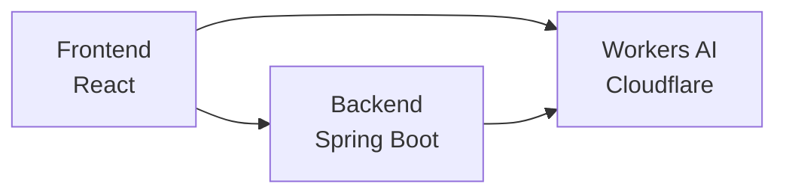

# API 매핑 문서

## 🔗 시스템 간 API 연결 구조



## 📊 API 엔드포인트 매핑 테이블

### ✅ 구현 완료 API

| 기능 | Frontend API | Backend Endpoint | Workers Endpoint | 상태 |
|------|-------------|------------------|------------------|------|
| **인증** |
| 네이버 로그인 | `auth.js` | `/login/oauth2/code/naver` | - | ✅ |
| 구글 로그인 | `auth.js` | `/login/oauth2/code/google` | - | ✅ |
| 토큰 갱신 | `auth.js` | `/api/v1/auth/refresh` | - | ✅ |
| **사용자 정보** |
| 영어 이름 저장 | `onboarding.js` | `/api/v1/user/english-name` | - | ✅ |
| 생년 저장 | `user.js` | `/api/v1/user/birthyear` | - | ✅ |
| 생일 저장 | `user.js` | `/api/v1/user/birthday` | - | ✅ |
| 거주지 저장 | `onboarding.js` | `/api/v1/user/location` | - | ✅ |
| 거주지 목록 | `onboarding.js` | `/api/v1/user/locations` | - | ✅ |
| 프로필 이미지 | `onboarding.js` | `/api/v1/user/profile-image` | - | ✅ |
| 자기소개 저장 | `onboarding.js` | `/api/v1/user/self-bio` | - | ✅ |
| 성별 저장 | `user.js` | `/api/v1/user/gender` | - | ✅ |
| **온보딩** |
| 언어 목록 | `onboarding.js` | `/api/v1/onboarding/language/languages` | - | ✅ |
| 모국어 설정 | `onboarding.js` | `/api/v1/onboarding/language/native-language` | - | ✅ |
| 언어 레벨 설정 | `onboarding.js` | `/api/v1/onboarding/language/language-level` | - | ✅ |
| 동기 목록 | `onboarding.js` | `/api/v1/onboarding/interest/motivations` | - | ✅ |
| 주제 목록 | `onboarding.js` | `/api/v1/onboarding/interest/topics` | - | ✅ |
| 학습 스타일 | `onboarding.js` | `/api/v1/onboarding/interest/learning-styles` | - | ✅ |
| 학습 기대 | `onboarding.js` | `/api/v1/onboarding/interest/learning-expectations` | - | ✅ |
| 파트너 성격 | `onboarding.js` | `/api/v1/onboarding/partner/personality` | - | ✅ |
| 그룹 크기 | `onboarding.js` | `/api/v1/onboarding/partner/group-size` | - | ✅ |
| 스케줄 설정 | `onboarding.js` | `/api/v1/onboarding/schedule/schedule` | - | ✅ |
| **레벨 테스트 (AI)** |
| 음성 인식 | `levelTest.js` | - | `/api/v1/leveltest/voice/transcribe` | ✅ |
| 레벨 평가 | `levelTest.js` | - | `/api/v1/leveltest/evaluate` | ✅ |
| **AI 피드백** |
| 실시간 피드백 | `levelTest.js` | - | `/api/v1/feedback/realtime` | ✅ |
| **분석** |
| 메트릭 조회 | `analytics.js` | - | `/api/v1/analytics/metrics` | ✅ |
| 사용자 통계 | `analytics.js` | - | `/api/v1/analytics/user-stats` | ✅ |
| **채팅** |
| 채팅방 목록 | `chat.js` | `/api/v1/chat/rooms` | - | ✅ |
| 채팅방 생성 | `chat.js` | `/api/v1/chat/rooms` | - | ✅ |
| 메시지 조회 | `chat.js` | `/api/v1/chat/rooms/{roomId}/messages` | - | ✅ |
| **매칭** |
| 파트너 검색 | `matching.js` | `/api/v1/matching/partners` | - | ✅ |
| 매칭 요청 | `matching.js` | `/api/v1/matching/request` | - | ✅ |
| 매칭 수락 | `matching.js` | `/api/v1/matching/accept/{matchId}` | - | ✅ |
| 매칭 거절 | `matching.js` | `/api/v1/matching/reject/{matchId}` | - | ✅ |
| **WebRTC** |
| 룸 생성 | `webrtc.js` | - | `/api/v1/webrtc/room/create` | ✅ |

### ⚠️ 미사용/중복 API

| 파일 | 문제점 | 권장 조치 |
|------|--------|----------|
| `mockApi.js` | 개발용 목 데이터 | 프로덕션에서 제거 필요 |
| `fileUpload.js` | `user.js`와 중복 | 통합 또는 제거 |
| `transcription.js` | Workers로 이관됨 | 제거 필요 |
| `profile.js` | `user.js`와 중복 | 통합 필요 |

### 🔴 미구현 API (백엔드는 있으나 프론트엔드 미연결)

| Backend Controller | Endpoint | 용도 | 상태 |
|-------------------|----------|------|------|
| `AchievementController` | `/api/v1/achievements/*` | 업적 시스템 | ❌ 미구현 |
| `GroupSessionController` | `/api/v1/group-sessions/*` | 그룹 세션 | ❌ 미구현 |
| `NotificationController` | `/api/v1/notifications/*` | 알림 시스템 | ⚠️ 부분구현 |
| `ClovaController` | `/api/v1/clova/*` | Clova AI | ❌ Workers로 대체 |

## 🔄 데이터 플로우

### 1. 레벨 테스트 플로우
```
Frontend → Workers AI (음성인식) → Workers AI (평가) → Frontend
```

### 2. 온보딩 플로우
```
Frontend → Backend (사용자 정보) → Backend (언어/관심사/파트너/스케줄) → Frontend
```

### 3. 채팅 플로우
```
Frontend → Backend (WebSocket) → Redis → Backend → Frontend
```

### 4. 화상통화 플로우
```
Frontend → Workers (WebRTC 시그널링) → P2P 연결 → Frontend
```

## 📝 API 정리 권장사항

### 1. 즉시 제거 필요
```javascript
// 제거 대상
- src/api/mockApi.js (프로덕션 불필요)
- src/api/transcription.js (Workers로 이관)
```

### 2. 통합 필요
```javascript
// profile.js + user.js → user.js로 통합
// fileUpload.js → user.js의 uploadProfileImage로 통합
```

### 3. 구현 필요
```javascript
// notifications.js - 백엔드 연동 완성
// settings.js - 설정 API 구현
// session.js - 세션 관리 구현
```

## 🔐 보안 체크리스트

### 현재 상태
- [x] JWT 토큰 인증 구현
- [x] CORS 설정 (Workers)
- [x] HTTPS 통신
- [x] 환경변수 분리

### 개선 필요
- [ ] API Rate Limiting
- [ ] Request Validation 강화
- [ ] Error Response 표준화
- [ ] API Key 관리 (Workers)

## 📊 API 사용 통계

### 가장 많이 호출되는 API (예상)
1. `/api/v1/auth/refresh` - 토큰 갱신
2. `/api/v1/chat/rooms/{roomId}/messages` - 채팅 메시지
3. `/api/v1/analytics/metrics` - 대시보드 메트릭

### 성능 최적화 필요
1. 채팅 메시지 - 페이지네이션 구현
2. 매칭 검색 - 캐싱 전략 필요
3. 프로필 이미지 - CDN 활용

## 🚀 다음 단계

### Phase 1 (긴급)
1. `mockApi.js` 제거
2. 중복 API 통합
3. Workers CORS 안정화

### Phase 2 (중요)
1. 알림 시스템 완성
2. 그룹 세션 구현
3. 업적 시스템 구현

### Phase 3 (개선)
1. API 응답 표준화
2. 에러 처리 통합
3. 성능 모니터링 추가